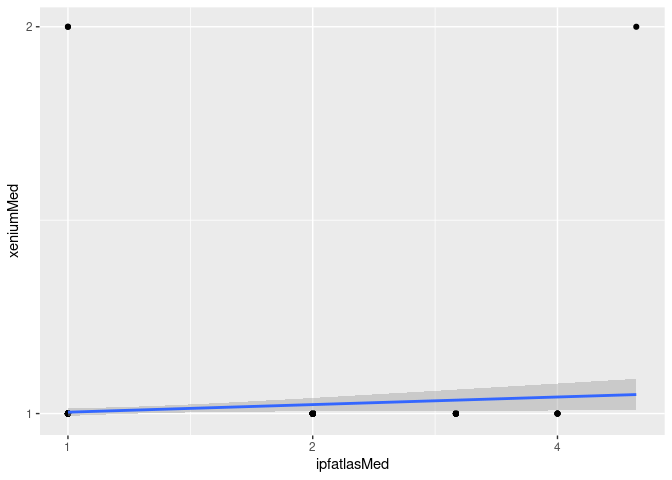

Probset performance measurements on slide 0020227
================

  - [Environment](#environment)
      - [Read in Xenium](#read-in-xenium)
      - [Read in IPF Cell Atlas
        GSE136831](#read-in-ipf-cell-atlas-gse136831)
      - [Normalize both datasets](#normalize-both-datasets)
  - [Comparison of raw counts between scRNA and
    Xenium](#comparison-of-raw-counts-between-scrna-and-xenium)
      - [Zero-suppressed average
        expression](#zero-suppressed-average-expression)
      - [Zero-suppressed median
        expression](#zero-suppressed-median-expression)
  - [Comparison of normalized counts between scRNA and
    Xenium](#comparison-of-normalized-counts-between-scrna-and-xenium)
      - [Zero-suppressed average normalized
        expression](#zero-suppressed-average-normalized-expression)
      - [Mix and match](#mix-and-match)

This is a slide that was run in December 2023. The slide includes one
section from the same block (the “good” block) done with the limited
library on 0010972 that gave some decent data. One triangular piece is a
scleroderma lung. The goal of this analysis is to look at components of
probeset behavior and whether that can be predicted from single cell
sequencing from reference datasets.

# Environment

``` r
library(Seurat)
```

    ## Loading required package: SeuratObject

    ## Loading required package: sp

    ## 'SeuratObject' was built under R 4.3.0 but the current version is
    ## 4.3.2; it is recomended that you reinstall 'SeuratObject' as the ABI
    ## for R may have changed

    ## 
    ## Attaching package: 'SeuratObject'

    ## The following object is masked from 'package:base':
    ## 
    ##     intersect

``` r
library(tidyverse)
```

    ## ── Attaching core tidyverse packages ──────────────────────────────────────────────────── tidyverse 2.0.0 ──
    ## ✔ dplyr     1.1.4     ✔ readr     2.1.5
    ## ✔ forcats   1.0.0     ✔ stringr   1.5.1
    ## ✔ ggplot2   3.4.4     ✔ tibble    3.2.1
    ## ✔ lubridate 1.9.3     ✔ tidyr     1.3.0
    ## ✔ purrr     1.0.2

    ## ── Conflicts ────────────────────────────────────────────────────────────────────── tidyverse_conflicts() ──
    ## ✖ dplyr::filter() masks stats::filter()
    ## ✖ dplyr::lag()    masks stats::lag()
    ## ℹ Use the conflicted package (<http://conflicted.r-lib.org/>) to force all conflicts to become errors

## Read in Xenium

``` r
ipf3.xen <- LoadXenium('output-XETG00143__0020227__Region_1__20231214__022306')
```

    ## 10X data contains more than one type and is being returned as a list containing matrices of each type.

    ## Warning: Feature names cannot have underscores ('_'), replacing with dashes
    ## ('-')
    
    ## Warning: Feature names cannot have underscores ('_'), replacing with dashes
    ## ('-')
    
    ## Warning: Feature names cannot have underscores ('_'), replacing with dashes
    ## ('-')
    
    ## Warning: Feature names cannot have underscores ('_'), replacing with dashes
    ## ('-')
    
    ## Warning: Feature names cannot have underscores ('_'), replacing with dashes
    ## ('-')
    
    ## Warning: Feature names cannot have underscores ('_'), replacing with dashes
    ## ('-')

## Read in IPF Cell Atlas GSE136831

``` r
original.dir <- ('~/vcalab-files/datasets/GSE136831_IPF_Cell_Atlas/')
metadata <- read_tsv(paste0(original.dir,'GSE136831_AllCells.Samples.CellType.MetadataTable.txt.gz'))
```

    ## Rows: 312928 Columns: 9
    ## ── Column specification ────────────────────────────────────────────────────────────────────────────────────
    ## Delimiter: "\t"
    ## chr (7): CellBarcode_Identity, CellType_Category, Manuscript_Identity, Subcl...
    ## dbl (2): nUMI, nGene
    ## 
    ## ℹ Use `spec()` to retrieve the full column specification for this data.
    ## ℹ Specify the column types or set `show_col_types = FALSE` to quiet this message.

``` r
metadata <- as.data.frame(metadata)
rownames(metadata) <- metadata$CellBarcode_Identity

features <- read_tsv(paste0(original.dir,'GSE136831_AllCells.GeneIDs.txt.gz'))
```

    ## Rows: 45947 Columns: 2
    ## ── Column specification ────────────────────────────────────────────────────────────────────────────────────
    ## Delimiter: "\t"
    ## chr (2): Ensembl_GeneID, HGNC_EnsemblAlt_GeneID
    ## 
    ## ℹ Use `spec()` to retrieve the full column specification for this data.
    ## ℹ Specify the column types or set `show_col_types = FALSE` to quiet this message.

``` r
cells <- read_tsv(paste0(original.dir,'GSE136831_AllCells.cellBarcodes.txt.gz'), col_names = F)
```

    ## Rows: 312928 Columns: 1
    ## ── Column specification ────────────────────────────────────────────────────────────────────────────────────
    ## Delimiter: "\t"
    ## chr (1): X1
    ## 
    ## ℹ Use `spec()` to retrieve the full column specification for this data.
    ## ℹ Specify the column types or set `show_col_types = FALSE` to quiet this message.

``` r
counts <- Matrix::readMM(paste0(original.dir,'GSE136831_RawCounts_Sparse.mtx.gz'))
rownames(counts) <- features$HGNC_EnsemblAlt_GeneID
colnames(counts) <- cells$X1
```

``` r
ipfatlas.cells <- CreateSeuratObject(counts=counts, meta.data=metadata)
```

    ## Warning: Data is of class dgTMatrix. Coercing to dgCMatrix.

``` r
rm(counts,cells,features,metadata)
gc()
```

    ##              used   (Mb) gc trigger    (Mb)   max used    (Mb)
    ## Ncells   33201204 1773.2  106306830  5677.4  106306830  5677.4
    ## Vcells 1150536909 8778.0 3670297946 28002.2 4285001700 32692.0

## Normalize both datasets

``` r
ipf3.xen <- NormalizeData(ipf3.xen)
```

    ## Normalizing layer: counts

``` r
ipfatlas.cells <- NormalizeData(ipfatlas.cells)
```

    ## Normalizing layer: counts

# Comparison of raw counts between scRNA and Xenium

Kind of stupidly one assumes that that among cells that express a target
transcript (count\>0), then there ought to be some correlation between
single cell sequencing and spatial detection. With the caveat that
segmentation is a mess. I am hesitant to use total transcript detection
because some targets are intended to identify rare cells and (correctly)
have low total detection across the slide. \#\# Housekeeping

``` r
# limit analysis to probes that can be assessed
probes <- intersect(rownames(ipf3.xen), rownames(ipfatlas.cells))
```

``` r
# Enable parallel processing - seurat does not play nice with parallel so all seurat processing should ideally be single-core
library(future)
plan(multisession, workers=6)
options(future.globals.maxSize = 104857600000000)
library(future.apply)
```

## Zero-suppressed average expression

``` r
nonzeroaverages <- data.frame(gene=probes,
                              xeniumAvg=unlist(future_lapply(probes, function(symbol){
                                counts <- ipf3.xen[['Xenium']]$counts[symbol,]
                                nonzeroavg <- mean(counts[counts!=0])
                                return(nonzeroavg)
                                })),
                              ipfatlasAvg=unlist(future_lapply(probes, function(symbol){
                                counts <- ipfatlas.cells[['RNA']]$counts[symbol,]
                                nonzeroavg <- mean(counts[counts!=0])
                                return(nonzeroavg)
                              }))
)
```

    ## Loading required package: SeuratObject

    ## Loading required package: sp

    ## ‘SeuratObject’ was built under R 4.3.0 but the current version is
    ## 4.3.2; it is recomended that you reinstall ‘SeuratObject’ as the ABI
    ## for R may have changed

    ## 
    ## Attaching package: ‘SeuratObject’

    ## The following object is masked from ‘package:base’:
    ## 
    ##     intersect

    ## Loading required package: SeuratObject

    ## Loading required package: sp

    ## ‘SeuratObject’ was built under R 4.3.0 but the current version is
    ## 4.3.2; it is recomended that you reinstall ‘SeuratObject’ as the ABI
    ## for R may have changed

    ## 
    ## Attaching package: ‘SeuratObject’

    ## The following object is masked from ‘package:base’:
    ## 
    ##     intersect

    ## Loading required package: SeuratObject

    ## Loading required package: sp

    ## ‘SeuratObject’ was built under R 4.3.0 but the current version is
    ## 4.3.2; it is recomended that you reinstall ‘SeuratObject’ as the ABI
    ## for R may have changed

    ## 
    ## Attaching package: ‘SeuratObject’

    ## The following object is masked from ‘package:base’:
    ## 
    ##     intersect

    ## Loading required package: SeuratObject

    ## Loading required package: sp

    ## ‘SeuratObject’ was built under R 4.3.0 but the current version is
    ## 4.3.2; it is recomended that you reinstall ‘SeuratObject’ as the ABI
    ## for R may have changed

    ## 
    ## Attaching package: ‘SeuratObject’

    ## The following object is masked from ‘package:base’:
    ## 
    ##     intersect

    ## Loading required package: SeuratObject

    ## Loading required package: sp

    ## ‘SeuratObject’ was built under R 4.3.0 but the current version is
    ## 4.3.2; it is recomended that you reinstall ‘SeuratObject’ as the ABI
    ## for R may have changed

    ## 
    ## Attaching package: ‘SeuratObject’

    ## The following object is masked from ‘package:base’:
    ## 
    ##     intersect

    ## Loading required package: SeuratObject

    ## Loading required package: sp

    ## ‘SeuratObject’ was built under R 4.3.0 but the current version is
    ## 4.3.2; it is recomended that you reinstall ‘SeuratObject’ as the ABI
    ## for R may have changed

    ## 
    ## Attaching package: ‘SeuratObject’

    ## The following object is masked from ‘package:base’:
    ## 
    ##     intersect

``` r
ggplot(data=nonzeroaverages, aes(x=ipfatlasAvg, y=xeniumAvg)) + 
  geom_point() +
  scale_x_continuous(trans='log2') +
  scale_y_continuous(trans='log2') +
  geom_smooth(method='lm', formula= y~x)
```

<!-- -->
Probes with much lower Xenium average than we would expect based on
expression.

``` r
lm(xeniumAvg~ipfatlasAvg, data=nonzeroaverages)
```

    ## 
    ## Call:
    ## lm(formula = xeniumAvg ~ ipfatlasAvg, data = nonzeroaverages)
    ## 
    ## Coefficients:
    ## (Intercept)  ipfatlasAvg  
    ##     1.05438      0.09528

Somewhat arbitrarily, let’s say something is somewhat lower expression
than we would expect, that would not be great.

``` r
folddiff <- 4
nonzeroaverages$shitlist1 <- unlist(lapply(nonzeroaverages$gene, function(symbol){
  expected <- (0.09528 /folddiff) * filter(nonzeroaverages,gene==symbol)$ipfatlasAvg + 1
  return(filter(nonzeroaverages,gene==symbol)$xeniumAvg < expected)
}))
```

``` r
ggplot(data=nonzeroaverages, aes(x=ipfatlasAvg, y=xeniumAvg)) + 
  geom_point(aes(color=factor(shitlist1))) +
  scale_x_continuous(trans='log2') +
  scale_y_continuous(trans='log2') +
  geom_smooth(method='lm', formula= y~x)
```

<!-- -->

``` r
filter(nonzeroaverages, shitlist1)
```

    ##        gene xeniumAvg ipfatlasAvg shitlist1
    ## 1      ARG1  1.015317    1.109474      TRUE
    ## 2     ARL14  1.021099    1.150538      TRUE
    ## 3     ASCL1  1.012780    2.652174      TRUE
    ## 4     ASCL2  1.015446    1.108058      TRUE
    ## 5     ASCL3  1.011023    3.888889      TRUE
    ## 6     CCNA1  1.031630    1.403930      TRUE
    ## 7      CCR3  1.011628    1.107388      TRUE
    ## 8      CD1A  1.059944    2.714611      TRUE
    ## 9      CD1C  1.050812    2.476870      TRUE
    ## 10     CD70  1.000000    1.455546      TRUE
    ## 11     CD8B  1.032255    1.479127      TRUE
    ## 12   CDKN2A  1.019265    1.546578      TRUE
    ## 13    CLCA1  1.007246    1.023404      TRUE
    ## 14    CLDN4  1.057780    3.208881      TRUE
    ## 15    CLDN5  1.046599    6.438662      TRUE
    ## 16     CST1  1.091813    5.168224      TRUE
    ## 17     CST4  1.012987    1.516667      TRUE
    ## 18    CXCR3  1.010204    1.358086      TRUE
    ## 19    CXCR5  1.015948    1.087302      TRUE
    ## 20   DIRAS3  1.014493    1.494200      TRUE
    ## 21    FASLG  1.026025    1.100429      TRUE
    ## 22    FOXA3  1.006897    1.040562      TRUE
    ## 23    FOXI1  1.015901    1.456522      TRUE
    ## 24    FOXN3  1.050212    3.385352      TRUE
    ## 25    GATA3  1.032744    1.391342      TRUE
    ## 26    IFNA1  1.011364    1.020202      TRUE
    ## 27    IFNB1  1.004959    1.605263      TRUE
    ## 28     IFNG  1.004860    2.139202      TRUE
    ## 29     IL13  1.015152    1.439306      TRUE
    ## 30    IL17A  1.022222    2.563636      TRUE
    ## 31      IL4  1.000000    1.059155      TRUE
    ## 32      IL5  1.005141    1.197674      TRUE
    ## 33   IQGAP2  1.056177    2.944629      TRUE
    ## 34     KLF7  1.008075    1.687776      TRUE
    ## 35    KLRB1  1.066230    3.091673      TRUE
    ## 36     LAG3  1.019173    1.258322      TRUE
    ## 37   LILRA5  1.014351    1.438866      TRUE
    ## 38    MMP12  1.053731    4.378042      TRUE
    ## 39      MPO  1.020595    1.039443      TRUE
    ## 40     NKG7  1.021909    4.179084      TRUE
    ## 41     NOS2  1.015700    1.058528      TRUE
    ## 42    PDCD1  1.010081    1.122254      TRUE
    ## 43      PI3  1.028621    2.595950      TRUE
    ## 44   PTGDR2  1.005510    1.015385      TRUE
    ## 45    RAMP2  1.062052    3.300251      TRUE
    ## 46     RBP4  1.077899    3.329302      TRUE
    ## 47     RETN  1.092315    4.267827      TRUE
    ## 48   RNASE3  1.013158    1.061103      TRUE
    ## 49     RORA  1.030769    2.226210      TRUE
    ## 50     RORC  1.022213    1.094127      TRUE
    ## 51    RUNX3  1.040937    2.137883      TRUE
    ## 52  S100A12  1.062036    3.939045      TRUE
    ## 53   S100A7  1.035573    3.413793      TRUE
    ## 54    SFTA2  1.159972    6.907276      TRUE
    ## 55  SIGLEC8  1.009747    1.107143      TRUE
    ## 56   SMIM24  1.019518    1.130326      TRUE
    ## 57    SPDEF  1.029680    1.259692      TRUE
    ## 58    SPRY2  1.025143    1.245623      TRUE
    ## 59     STC1  1.073282    4.511579      TRUE
    ## 60    TCL1A  1.009298    2.222872      TRUE
    ## 61     TFF2  1.000000    1.171821      TRUE
    ## 62     TFF3  1.039402    5.271374      TRUE
    ## 63  TM4SF18  1.031287    1.756336      TRUE
    ## 64 TNFRSF17  1.020747    1.797513      TRUE
    ## 65 TNFRSF18  1.003106    1.576033      TRUE
    ## 66     TSLP  1.013596    1.120773      TRUE
    ## 67    UPK3B  1.029619    2.100000      TRUE

## Zero-suppressed median expression

``` r
nonzeromedians <- data.frame(gene=probes,
                              xeniumMed=unlist(future_lapply(probes, function(symbol){
                                counts <- ipf3.xen[['Xenium']]$counts[symbol,]
                                nonzeroavg <- median(counts[counts!=0])
                                return(nonzeroavg)
                                })),
                              ipfatlasMed=unlist(future_lapply(probes, function(symbol){
                                counts <- ipfatlas.cells[['RNA']]$counts[symbol,]
                                nonzeroavg <- median(counts[counts!=0])
                                return(nonzeroavg)
                              }))
)
```

``` r
ggplot(data=nonzeromedians, aes(x=ipfatlasMed, y=xeniumMed)) + 
  geom_point() +
  scale_x_continuous(trans='log2') +
  scale_y_continuous(trans='log2') +
  geom_smooth(method='lm', formula= y~x)
```

<!-- -->
\#\# zero-suppressed top decile expression

``` r
nonzerodecile <- data.frame(gene=probes,
                              xeniumDec=unlist(future_lapply(probes, function(symbol){
                                counts <- ipf3.xen[['Xenium']]$counts[symbol,]
                                nonzeroDec <- quantile(counts[counts!=0], probs=0.9)
                                return(nonzeroDec)
                                })),
                              ipfatlasDec=unlist(future_lapply(probes, function(symbol){
                                counts <- ipfatlas.cells[['RNA']]$counts[symbol,]
                                nonzeroDec <- quantile(counts[counts!=0], probs=0.9)
                                return(nonzeroDec)
                              }))
)
```

``` r
ggplot(data=nonzerodecile, aes(x=ipfatlasDec, y=xeniumDec)) + 
  geom_point() +
  scale_x_continuous(trans='log2') +
  scale_y_continuous(trans='log2') +
  geom_smooth(method='lm', formula= y~x)
```

<!-- -->

# Comparison of normalized counts between scRNA and Xenium

This might better account for cells wtih low overall detection, and also
has the advantage of being somewhat closer to what actual analysis might
be like.

## Zero-suppressed average normalized expression

``` r
nonzeroaverages$xeniumNormAvg <- unlist(future_lapply(probes, function(symbol){
  counts <- GetAssayData(object = ipf3.xen, slot = 'data')[symbol,]
  nonzeroavg <- mean(counts[counts>0])
  return(nonzeroavg)
}))
```

    ## Warning: The `slot` argument of `GetAssayData()` is deprecated as of SeuratObject 5.0.0.
    ## ℹ Please use the `layer` argument instead.
    ## This warning is displayed once every 8 hours.
    ## Call `lifecycle::last_lifecycle_warnings()` to see where this warning was generated.

    ## Warning: The `slot` argument of `GetAssayData()` is deprecated as of SeuratObject 5.0.0.
    ## ℹ Please use the `layer` argument instead.
    ## This warning is displayed once every 8 hours.
    ## Call `lifecycle::last_lifecycle_warnings()` to see where this warning was generated.

    ## Warning: The `slot` argument of `GetAssayData()` is deprecated as of SeuratObject 5.0.0.
    ## ℹ Please use the `layer` argument instead.
    ## This warning is displayed once every 8 hours.
    ## Call `lifecycle::last_lifecycle_warnings()` to see where this warning was generated.

    ## Warning: The `slot` argument of `GetAssayData()` is deprecated as of SeuratObject 5.0.0.
    ## ℹ Please use the `layer` argument instead.
    ## This warning is displayed once every 8 hours.
    ## Call `lifecycle::last_lifecycle_warnings()` to see where this warning was generated.

    ## Warning: The `slot` argument of `GetAssayData()` is deprecated as of SeuratObject 5.0.0.
    ## ℹ Please use the `layer` argument instead.
    ## This warning is displayed once every 8 hours.
    ## Call `lifecycle::last_lifecycle_warnings()` to see where this warning was generated.

    ## Warning: The `slot` argument of `GetAssayData()` is deprecated as of SeuratObject 5.0.0.
    ## ℹ Please use the `layer` argument instead.
    ## This warning is displayed once every 8 hours.
    ## Call `lifecycle::last_lifecycle_warnings()` to see where this warning was generated.

``` r
nonzeroaverages$ipfatlasNormAvg <- unlist(future_lapply(probes, function(symbol){
  counts <- GetAssayData(object = ipfatlas.cells, slot = 'data')[symbol,]
  nonzeroavg <- mean(counts[counts>0])
  return(nonzeroavg)
}))
```

``` r
ggplot(data=nonzeroaverages, aes(x=ipfatlasNormAvg, y=xeniumNormAvg)) + 
  geom_point() +
  geom_smooth(method='lm', formula= y~x)
```

<!-- -->
Probes with much lower Xenium average than we would expect based on
expression.

``` r
lm(xeniumNormAvg ~ ipfatlasNormAvg, data = nonzeroaverages)
```

    ## 
    ## Call:
    ## lm(formula = xeniumNormAvg ~ ipfatlasNormAvg, data = nonzeroaverages)
    ## 
    ## Coefficients:
    ##     (Intercept)  ipfatlasNormAvg  
    ##          5.6541           0.3421

Somewhat arbitrarily, let’s say something is some-fold lower normalized
expression than we would expect, that would not be great.

``` r
logdiff <- .6
nonzeroaverages$shitlist2 <- unlist(lapply(nonzeroaverages$gene, function(symbol){
  expected <- 0.3421 * filter(nonzeroaverages,gene==symbol)$ipfatlasNormAvg + 5.6541 - logdiff
  return(filter(nonzeroaverages,gene==symbol)$xeniumNormAvg < expected)
}))
```

``` r
ggplot(data=nonzeroaverages, aes(x=ipfatlasNormAvg, y=xeniumNormAvg)) + 
  geom_point(aes(color=factor(shitlist2))) +
  geom_smooth(method='lm', formula= y~x)
```

<!-- -->

``` r
filter(nonzeroaverages, shitlist2)
```

    ##      gene xeniumAvg ipfatlasAvg shitlist1 xeniumNormAvg ipfatlasNormAvg
    ## 1   CLDN4  1.057780    3.208881      TRUE      5.290944       1.2973455
    ## 2    ELF3  1.340011    5.474371     FALSE      5.617571       1.6967458
    ## 3   FOXA2  1.057750    1.030303     FALSE      5.279343       0.7067073
    ## 4   GDF15  1.347594    2.820631     FALSE      5.282730       1.1693547
    ## 5  IL17RB  1.211359    1.218340     FALSE      5.244558       0.8110011
    ## 6    KLF5  1.297584    2.187218     FALSE      5.411537       1.1264546
    ## 7   MUC16  1.312336    2.259031     FALSE      5.448747       1.1636884
    ## 8   NCEH1  1.357214    3.026125     FALSE      5.517750       1.3914294
    ## 9    RBP4  1.077899    3.329302      TRUE      5.466767       1.2353999
    ## 10   RETN  1.092315    4.267827      TRUE      5.222207       1.6032702
    ## 11 S100A9  1.313681    8.113633     FALSE      5.657533       2.0274530
    ## 12  SFTA2  1.159972    6.907276      TRUE      5.538653       1.7055857
    ##    shitlist2
    ## 1       TRUE
    ## 2       TRUE
    ## 3       TRUE
    ## 4       TRUE
    ## 5       TRUE
    ## 6       TRUE
    ## 7       TRUE
    ## 8       TRUE
    ## 9       TRUE
    ## 10      TRUE
    ## 11      TRUE
    ## 12      TRUE

## Mix and match

SPARPOS is going to want to filter on norm avg expression. So does that
clearly predict whether raw counts are found in Xenium?

``` r
ggplot(data=nonzeroaverages, aes(x=ipfatlasNormAvg, y=xeniumAvg)) + 
  geom_point() +
  scale_y_continuous(trans='log2') +
  geom_smooth(method='lm', formula= y~x)
```

<!-- -->
I think the answer is, sort of. But really the conclusion seems to be
that there are high-performing probes that aren’t as sensitive to low
expression, assuming they are specific.

``` r
xenrawthreshold <- 1.5
nonzeroaverages$winner1 <- unlist(lapply(nonzeroaverages$gene, function(symbol){
  return(filter(nonzeroaverages,gene==symbol)$xeniumAvg > xenrawthreshold)
}))
```

``` r
ggplot(data=nonzeroaverages, aes(x=ipfatlasNormAvg, y=xeniumAvg)) + 
  geom_point(aes(color=factor(winner1))) +
  scale_y_continuous(trans='log2') +
  geom_smooth(method='lm', formula= y~x)
```

<!-- -->

``` r
filter(nonzeroaverages, winner1)
```

    ##        gene xeniumAvg ipfatlasAvg shitlist1 xeniumNormAvg ipfatlasNormAvg
    ## 1     ABCA3  2.557023    2.123743     FALSE      6.083660       1.1400009
    ## 2      AGR2  1.684523    4.149697     FALSE      5.691972       1.3324659
    ## 3    ALOX15  1.577000    2.418057     FALSE      6.038317       1.1230962
    ## 4   ALOX15B  2.084026    1.508238     FALSE      5.803463       0.9355292
    ## 5     ANPEP  1.813767    2.743068     FALSE      6.141096       1.4712796
    ## 6      APOD  1.541977    4.475592     FALSE      6.585613       1.3748282
    ## 7      AREG  1.614811    6.522397     FALSE      6.055301       2.0313897
    ## 8    ATP1B1  1.573614    2.339155     FALSE      5.780670       1.2076023
    ## 9    CCDC78  1.528022    3.059291     FALSE      6.079279       1.3474054
    ## 10    CD163  1.858800    1.920827     FALSE      6.311918       1.2102073
    ## 11     CDH1  1.604368    4.456958     FALSE      5.700287       1.5095261
    ## 12  CEACAM6  1.715160    4.112094     FALSE      5.942191       1.3267291
    ## 13    CHIT1  3.669701    7.505662     FALSE      6.324976       1.4374753
    ## 14   COL1A1  2.705605   15.986456     FALSE      7.032845       1.7483165
    ## 15     CTSL  1.683207    5.446883     FALSE      5.947158       1.7914874
    ## 16    CXCL5  2.301587    4.069675     FALSE      5.861095       1.4932531
    ## 17      DES  2.440839    3.249313     FALSE      6.915670       1.4524093
    ## 18    DMBT1  4.456076    2.747852     FALSE      6.620360       1.1326323
    ## 19    DUSP1  1.661106    6.649764     FALSE      6.344427       2.1944846
    ## 20       F3  1.668249    3.041426     FALSE      5.821903       1.3402789
    ## 21     FASN  1.528711    1.332951     FALSE      5.754689       0.8896625
    ## 22   FCGR3A  1.712243    2.883638     FALSE      6.157328       1.4284256
    ## 23       HP  1.857127    2.920670     FALSE      6.115822       1.1420298
    ## 24   IL1RL1  1.672828    3.266426     FALSE      6.616189       1.8828779
    ## 25     IL7R  1.507504    2.305587     FALSE      6.677526       1.4333324
    ## 26     IRF8  1.609156    1.899658     FALSE      6.068748       1.1961853
    ## 27    ITGB6  1.837178    1.994403     FALSE      5.696251       1.0948932
    ## 28      KIT  1.770110    2.266623     FALSE      6.757843       1.6966160
    ## 29    KRT15  1.583295    3.885813     FALSE      5.805737       1.2509623
    ## 30     KRT7  2.146280    5.218522     FALSE      6.116442       1.3801602
    ## 31     KRT8  2.077903    3.317619     FALSE      6.207626       1.2746174
    ## 32   LGALS3  1.717660    7.891245     FALSE      5.986504       2.0209148
    ## 33    LTBP2  1.652350    1.561329     FALSE      6.660104       1.0728245
    ## 34      LTF  2.814307    5.590604     FALSE      6.121793       1.1967007
    ## 35    MARCO  4.093736    7.974557     FALSE      6.598209       2.1055201
    ## 36   MCEMP1  2.179184    3.696986     FALSE      6.195404       1.5365205
    ## 37     MMP1  2.536552    5.630732     FALSE      6.299502       1.3939546
    ## 38     MMP9  2.107709    4.941130     FALSE      6.366140       1.3341455
    ## 39    MMRN1  1.527321    3.607162     FALSE      6.568953       1.7779389
    ## 40    MS4A2  1.608724    1.920877     FALSE      6.623105       1.7995681
    ## 41     MUC1  2.360543    1.093651     FALSE      6.111267       0.7458261
    ## 42   MUC5AC  2.442357    2.584973     FALSE      6.095807       0.9353766
    ## 43    MUC5B  3.575068    3.697230     FALSE      6.224405       1.1199632
    ## 44    MYH11  2.900709    1.496255     FALSE      7.115196       1.1075712
    ## 45  PCOLCE2  1.616403    2.069813     FALSE      5.539477       1.1193437
    ## 46  PLA2G2A  1.580123   14.681452     FALSE      6.392244       1.8512704
    ## 47  PLA2G4F  1.769581    1.319344     FALSE      5.831686       0.9025515
    ## 48    POSTN  1.939167    7.963799     FALSE      6.792400       1.8549922
    ## 49     SCEL  1.554984    1.958506     FALSE      5.872437       1.2068944
    ## 50 SERPINB2  2.322143    3.055776     FALSE      6.271697       1.7658850
    ## 51    SFTPD  2.382406    7.228791     FALSE      6.212656       1.6445363
    ## 52   SHANK3  1.505740    1.665427     FALSE      6.610035       1.2381973
    ## 53  SLC18A2  1.507665    1.146801     FALSE      6.614009       1.0725966
    ## 54   STEAP4  1.777264    2.023849     FALSE      5.856262       1.0524852
    ## 55  TMEM100  1.556928    2.770645     FALSE      6.670949       1.6660469
    ## 56  TMPRSS2  2.087950    1.826200     FALSE      6.004576       1.0576144
    ## 57    VEGFA  1.517072    1.655713     FALSE      6.058314       1.3105112
    ## 58    VSIG4  2.379308    4.159638     FALSE      6.216639       1.5932102
    ## 59      VWF  1.811901    3.603351     FALSE      6.853660       1.4483012
    ## 60     XBP1  1.650791    1.816572     FALSE      6.090151       1.1801729
    ##    shitlist2 winner1
    ## 1      FALSE    TRUE
    ## 2      FALSE    TRUE
    ## 3      FALSE    TRUE
    ## 4      FALSE    TRUE
    ## 5      FALSE    TRUE
    ## 6      FALSE    TRUE
    ## 7      FALSE    TRUE
    ## 8      FALSE    TRUE
    ## 9      FALSE    TRUE
    ## 10     FALSE    TRUE
    ## 11     FALSE    TRUE
    ## 12     FALSE    TRUE
    ## 13     FALSE    TRUE
    ## 14     FALSE    TRUE
    ## 15     FALSE    TRUE
    ## 16     FALSE    TRUE
    ## 17     FALSE    TRUE
    ## 18     FALSE    TRUE
    ## 19     FALSE    TRUE
    ## 20     FALSE    TRUE
    ## 21     FALSE    TRUE
    ## 22     FALSE    TRUE
    ## 23     FALSE    TRUE
    ## 24     FALSE    TRUE
    ## 25     FALSE    TRUE
    ## 26     FALSE    TRUE
    ## 27     FALSE    TRUE
    ## 28     FALSE    TRUE
    ## 29     FALSE    TRUE
    ## 30     FALSE    TRUE
    ## 31     FALSE    TRUE
    ## 32     FALSE    TRUE
    ## 33     FALSE    TRUE
    ## 34     FALSE    TRUE
    ## 35     FALSE    TRUE
    ## 36     FALSE    TRUE
    ## 37     FALSE    TRUE
    ## 38     FALSE    TRUE
    ## 39     FALSE    TRUE
    ## 40     FALSE    TRUE
    ## 41     FALSE    TRUE
    ## 42     FALSE    TRUE
    ## 43     FALSE    TRUE
    ## 44     FALSE    TRUE
    ## 45     FALSE    TRUE
    ## 46     FALSE    TRUE
    ## 47     FALSE    TRUE
    ## 48     FALSE    TRUE
    ## 49     FALSE    TRUE
    ## 50     FALSE    TRUE
    ## 51     FALSE    TRUE
    ## 52     FALSE    TRUE
    ## 53     FALSE    TRUE
    ## 54     FALSE    TRUE
    ## 55     FALSE    TRUE
    ## 56     FALSE    TRUE
    ## 57     FALSE    TRUE
    ## 58     FALSE    TRUE
    ## 59     FALSE    TRUE
    ## 60     FALSE    TRUE
