Simulation of SPAPROS probesets for spatial transcriptomics
================

- [Environment](#environment)
  - [Read in IPF Cell Atlas
    (GSE136831)](#read-in-ipf-cell-atlas-gse136831)
- [Simulate SPAPROS basic probeset](#simulate-spapros-basic-probeset)
  - [Standard clustering](#standard-clustering)
  - [Subset epithelium](#subset-epithelium)
  - [Subset fibroblasts](#subset-fibroblasts)
- [Simulate SPAPROS high expression
  panel](#simulate-spapros-high-expression-panel)
  - [Standard clustering](#standard-clustering-1)
  - [Subset epithelium](#subset-epithelium-1)
  - [Subset fibroblasts](#subset-fibroblasts-1)

For probe-based spatial transcriptomics, the number and identity of
genes that have probesets is limited. This script queries how this
restricted gene set might perform in cell identification by routine
clustering.

# Environment

``` r
library(tidyverse)
library(Seurat)
library(SeuratWrappers)
library(RColorBrewer)
spectral.colors <- colorRampPalette(rev(brewer.pal(9,'Spectral')))
```

## Read in IPF Cell Atlas (GSE136831)

This notebook depends on the output of the read-in script. for
convenience, can bypass script by loading stored Seurat object directly.

``` r
# This is more reliable
#source(knitr::purl("IPF-Cell-Atlas__read-in.Rmd", quiet=TRUE))
knitr::knit("IPF-Cell-Atlas__read-in.Rmd", output = tempfile())
```

    ## 
    ## 
    ## processing file: IPF-Cell-Atlas__read-in.Rmd

    ##   |                                                           |                                                   |   0%  |                                                           |......                                             |  11%                     |                                                           |...........                                        |  22% [unnamed-chunk-30]  |                                                           |.................                                  |  33%                     |                                                           |.......................                            |  44% [unnamed-chunk-31]  |                                                           |............................                       |  56% [unnamed-chunk-32]  |                                                           |..................................                 |  67% [unnamed-chunk-33]  |                                                           |........................................           |  78%                     |                                                           |.............................................      |  89% [unnamed-chunk-34]  |                                                           |...................................................| 100% [unnamed-chunk-35]

    ## output file: /tmp/Rtmp5h6hib/file495335dd98920

    ## [1] "/tmp/Rtmp5h6hib/file495335dd98920"

``` r
# faster
load('ipfatlas.cells_fromd8d92b9.Robj')
```

# Simulate SPAPROS basic probeset

This panel used SPAPROS to identify 200 genes using basic paremeters, no
restrictions on expression etc.

``` r
basic200.genes <- read.csv('SPAPROS-basic200.csv', header = TRUE)$X
```

``` r
ipfatlas.basic200.cells <- subset(ipfatlas.cells, features=basic200.genes)
```

Some genes are occasionally missing. These are the missing genes:

``` r
setdiff(basic200.genes, rownames(ipfatlas.basic200.cells))
```

    ## character(0)

## Standard clustering

``` r
ipfatlas.basic200.cells <- NormalizeData(ipfatlas.basic200.cells)
```

    ## Normalizing layer: counts

``` r
ipfatlas.basic200.cells <- FindVariableFeatures(ipfatlas.basic200.cells)
```

    ## Finding variable features for layer counts

``` r
ipfatlas.basic200.cells <- ScaleData(ipfatlas.basic200.cells, features=rownames(ipfatlas.basic200.cells))
```

    ## Centering and scaling data matrix

``` r
ipfatlas.basic200.cells <- RunPCA(ipfatlas.basic200.cells)
```

    ## PC_ 1 
    ## Positive:  CCL5, CD247, PPP1R16B, ITK, CD69, CNOT6L, FYN, KLRC4-KLRK1, GZMB, SKAP1 
    ##     GNG2, PRF1, IL32, RNF125, GZMA, BCL11B, NKG7, CD3D, CST7, SLC38A1 
    ##     LINC01871, GZMH, GNLY, CD3E, STAT4, CD2, KLRB1, SYNE2, PBX4, CARD11 
    ## Negative:  MSR1, APOC1, C1QA, C1QB, C1QC, APOE, CXCL3, S100A8, THBS1, CXCL2 
    ##     FN1, RETN, CCL18, FABP4, VCAN, LSAMP, ENSG00000239268, CXCL8, EREG, IL1B 
    ##     C15orf48, CCL20, RNASE1, CXCL5, NLRP3, HSPA1A, RND3, MAMLD1, ATP10A, PID1 
    ## PC_ 2 
    ## Positive:  PARD3, MAGI1, LIMCH1, ELF3, NEBL, KIAA1217, ENSG00000283563, IGFBP7, EMP2, KRT19 
    ##     GPRC5A, SLPI, SPTBN1, CLU, SDK1, WFDC2, CCDC80, MGP, CDH1, CYP2B7P 
    ##     SPARCL1, CALD1, LRRIQ1, TM4SF1, TIMP3, PRKG1, MAST4, HYDIN, NEDD4L, LINC00511 
    ## Negative:  MSR1, C1QA, C1QC, C1QB, S100A8, APOC1, CXCL3, RETN, CRYBG1, EREG 
    ##     AREG, NLRP3, AOAH, THBS1, CCL4, RGS1, APOE, IL1B, RHOH, STAT4 
    ##     NKG7, CCL5, DUSP2, CD69, CCL18, FAM129A, FABP4, VCAN, FCN1, C15orf48 
    ## PC_ 3 
    ## Positive:  ELF3, CYP2B7P, WFDC2, CDH1, KRT19, LRRIQ1, PIGR, CFAP299, NEDD4L, DNAH12 
    ##     HYDIN, PACRG, ANK3, SLPI, SFTPB, LINC00511, NEBL, AGBL4, SFTA2, NAPSA 
    ##     KRT7, SFTPA2, SFTPD, SFTPA1, MACROD2, SFTPC, KIAA1217, LIMCH1, MAGI1, SCGB3A2 
    ## Negative:  SPARCL1, COL1A2, MGP, LUM, COL6A2, CALD1, COL3A1, DCN, FBLN1, COL1A1 
    ##     TIMP3, TPM2, CRISPLD2, MT1M, MYL9, CCDC80, A2M, LDB2, EBF1, LAMA2 
    ##     TSHZ2, PRKG1, IGFBP7, ENSG00000283563, ZEB1, PTPRB, RORA, MT1X, DLC1, VWF 
    ## PC_ 4 
    ## Positive:  FABP4, ENSG00000239268, ATP10A, C1QB, LSAMP, C1QA, APOC1, C1QC, RND3, APOE 
    ##     CCL18, FN1, MSR1, IFI27, CXCL5, RETN, CTSW, FAM129A, CCL5, DCN 
    ##     CD3D, CXCL3, RORA-AS1, GZMH, HSPA1A, GZMA, KLRC4-KLRK1, GZMB, SKAP1, IL32 
    ## Negative:  IL1R2, PID1, NLRP3, FCN1, AREG, EREG, S100A12, VCAN, G0S2, ADAM28 
    ##     PLCB1, MAMLD1, AFF3, SDS, THBS1, C15orf48, CXCL8, S100A8, TNFRSF13C, MCTP2 
    ##     EBF1, RGS1, BANK1, BACH2, IL1B, ANKRD33B, CRISPLD2, CCL2, ADAM19, MT1X 
    ## PC_ 5 
    ## Positive:  NKG7, GNLY, PRF1, KLRD1, GZMB, CCL4, NAPSA, SFTPA1, C1orf21, SFTPA2 
    ##     HOPX, SFTA2, CTSW, SFTPB, SFTPD, KLRC4-KLRK1, CST7, SFTPC, GZMH, CCL4L2 
    ##     MCTP2, YES1, GZMA, CXCL2, KLRB1, ENSG00000276085, CXCL8, ZNF385B, CD247, AOAH 
    ## Negative:  TNFRSF13C, PBX4, ADAM19, ZEB1, INPP4B, BANK1, BACH2, CDC14A, RHOH, EBF1 
    ##     ST6GAL1, ADAM28, BATF, ANK3, LRRIQ1, AFF3, CFAP299, CRYBG1, HYDIN, PACRG 
    ##     DNAH12, THEMIS, PPP1R16B, ENSG00000240040, AGBL4, BCL11B, TRAC, ITK, TSHZ2, FAM129A

``` r
ipfatlas.basic200.cells <- RunUMAP(ipfatlas.basic200.cells, dims=1:30)
```

    ## Warning: The default method for RunUMAP has changed from calling Python UMAP via reticulate to the R-native UWOT using the cosine metric
    ## To use Python UMAP via reticulate, set umap.method to 'umap-learn' and metric to 'correlation'
    ## This message will be shown once per session

    ## 12:23:55 UMAP embedding parameters a = 0.9922 b = 1.112

    ## 12:23:55 Read 253424 rows and found 30 numeric columns

    ## 12:23:55 Using Annoy for neighbor search, n_neighbors = 30

    ## 12:23:55 Building Annoy index with metric = cosine, n_trees = 50

    ## 0%   10   20   30   40   50   60   70   80   90   100%

    ## [----|----|----|----|----|----|----|----|----|----|

    ## **************************************************|
    ## 12:24:40 Writing NN index file to temp file /tmp/Rtmp5h6hib/file4953337ba2a2c
    ## 12:24:41 Searching Annoy index using 1 thread, search_k = 3000
    ## 12:26:54 Annoy recall = 100%
    ## 12:26:54 Commencing smooth kNN distance calibration using 1 thread with target n_neighbors = 30
    ## 12:27:09 Initializing from normalized Laplacian + noise (using RSpectra)
    ## 12:27:50 Commencing optimization for 200 epochs, with 12121188 positive edges
    ## 12:30:28 Optimization finished

``` r
DimPlot(ipfatlas.basic200.cells, group.by='CellType_Category')
```

    ## Rasterizing points since number of points exceeds 100,000.
    ## To disable this behavior set `raster=FALSE`

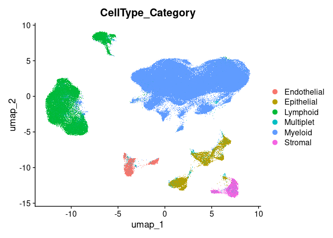<!-- -->

``` r
DimPlot(ipfatlas.basic200.cells, group.by='Manuscript_Identity')
```

    ## Rasterizing points since number of points exceeds 100,000.
    ## To disable this behavior set `raster=FALSE`

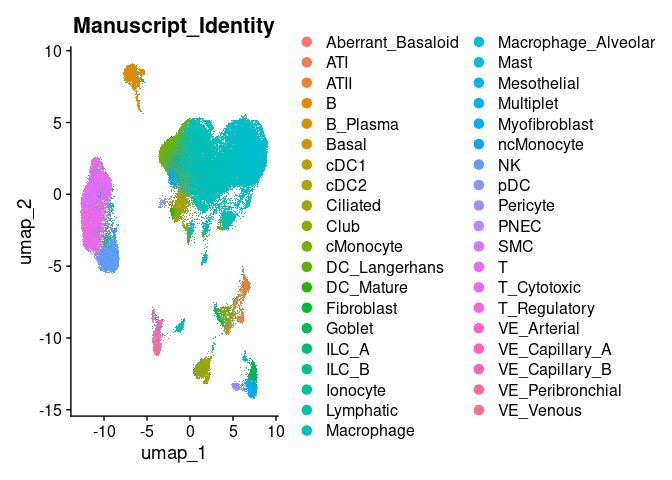<!-- -->

``` r
DimPlot(ipfatlas.basic200.cells, group.by='Subclass_Cell_Identity')
```

    ## Rasterizing points since number of points exceeds 100,000.
    ## To disable this behavior set `raster=FALSE`

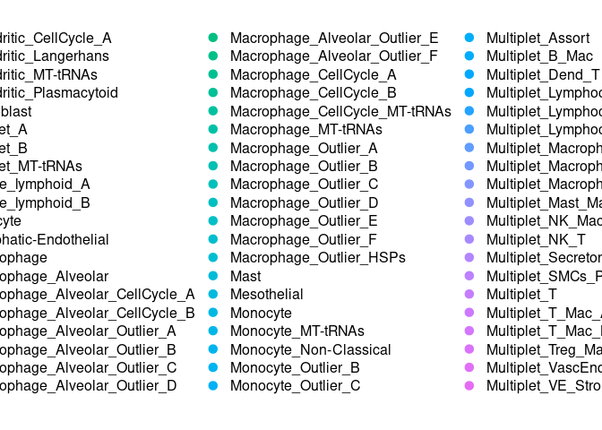<!-- -->

``` r
DimPlot(ipfatlas.basic200.cells, group.by='Subject_Identity')
```

    ## Rasterizing points since number of points exceeds 100,000.
    ## To disable this behavior set `raster=FALSE`

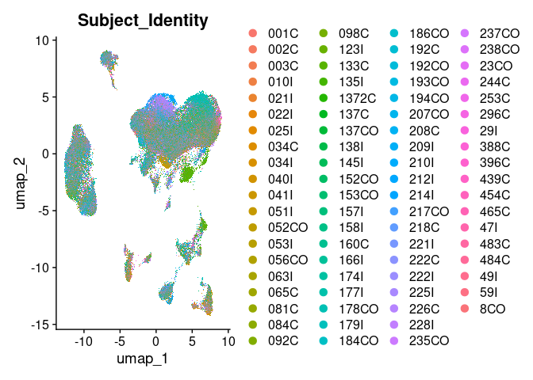<!-- -->

``` r
DimPlot(ipfatlas.basic200.cells, group.by='Disease_Identity')
```

    ## Rasterizing points since number of points exceeds 100,000.
    ## To disable this behavior set `raster=FALSE`

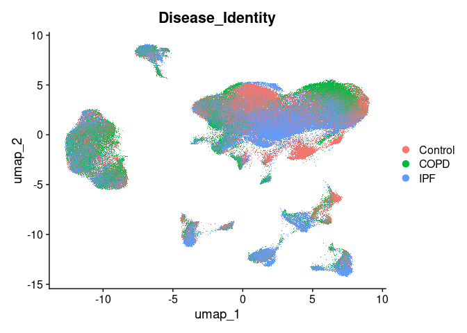<!-- -->
\## Explore PCA contributions Genes have expression correlated with each
other, and some of those modules are more useful than others in
separating populations of cells. First establish how many PCAs explain
most of the variance.

``` r
ElbowPlot(ipfatlas.basic200.cells)
```

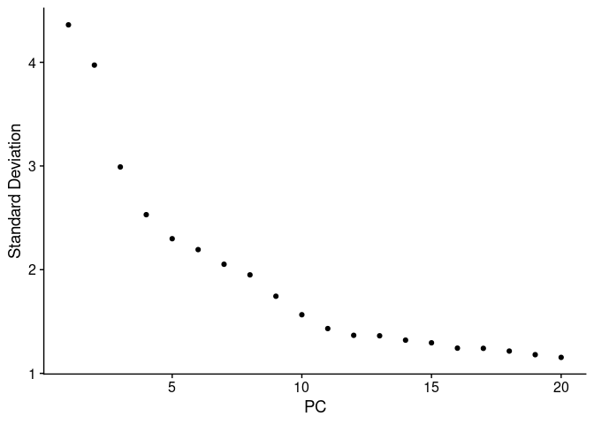<!-- -->

``` r
DimHeatmap(ipfatlas.basic200.cells, dims = 1:3, cells = 200, balanced = TRUE)
```

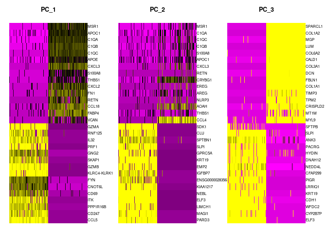<!-- -->

``` r
DimHeatmap(ipfatlas.basic200.cells, dims = 4:6, cells = 200, balanced = TRUE)
```

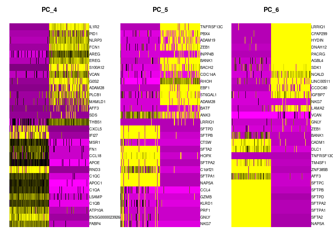<!-- -->

``` r
DimHeatmap(ipfatlas.basic200.cells, dims = 7:9, cells = 200, balanced = TRUE)
```

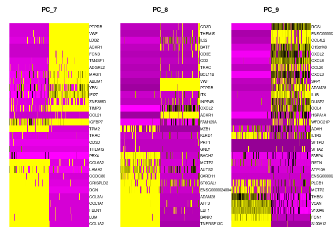<!-- -->

## Subset epithelium

``` r
ipfatlas.basic200.epi.cells <- subset(ipfatlas.basic200.cells, subset=CellType_Category=='Epithelial')
```

``` r
ipfatlas.basic200.epi.cells <- NormalizeData(ipfatlas.basic200.epi.cells)
```

    ## Normalizing layer: counts

``` r
ipfatlas.basic200.epi.cells <- FindVariableFeatures(ipfatlas.basic200.epi.cells)
```

    ## Finding variable features for layer counts

``` r
ipfatlas.basic200.epi.cells <- ScaleData(ipfatlas.basic200.epi.cells, features=rownames(ipfatlas.basic200.epi.cells))
```

    ## Centering and scaling data matrix

``` r
ipfatlas.basic200.epi.cells <- RunPCA(ipfatlas.basic200.epi.cells)
```

    ## PC_ 1 
    ## Positive:  SFTPB, NAPSA, SFTA2, SFTPC, SFTPA2, SFTPA1, SFTPD, HOPX, CXCL2, RNASE1 
    ##     DLC1, ZNF385B, AFF3, CADM1, GPRC5A, PID1, TM4SF1, CXCL8, PRKG1, CEMIP2 
    ##     CCL20, SCGB3A2, AREG, CXCL3, KRT7, AUTS2, IL32, MT1G, MT1X, TIMP3 
    ## Negative:  CFAP299, HYDIN, DNAH12, LRRIQ1, PACRG, AGBL4, SDK1, IGFBP7, NCALD, CDC14A 
    ##     SYNE2, LAMA2, CLU, LINC00511, ANK3, SYNE1, KIAA1217, INPP4B, MAGI1, TSHZ2 
    ##     CCDC80, WFDC21P, ELF3, PARD3, WFDC2, PBX4, IFI27, MTND4P12, HSPA1A, SPP1 
    ## PC_ 2 
    ## Positive:  CALD1, COL6A2, HAS1, MT1M, TM4SF1, ENSG00000283563, BACH2, MT1X, TPM2, CCL2 
    ##     KRT19, TIMP3, GPRC5A, COL1A1, KRT7, COL1A2, LSAMP, CRISPLD2, MIR205HG, COL3A1 
    ##     RND3, DCN, MYL9, PLCB1, ABLIM1, RORA, IL32, MGP, FBLN1, ANKRD33B 
    ## Negative:  SFTPC, SFTPA1, SFTPA2, ANK3, SYNE1, ZNF385B, AFF3, SFTPD, CFAP299, DNAH12 
    ##     LRRIQ1, HYDIN, AGBL4, NAPSA, PACRG, PIGR, SLPI, MACROD2, C1orf21, NCALD 
    ##     SFTPB, LIMCH1, SFTA2, ELF3, CCL20, AUTS2, CYP2B7P, LAMA2, CDC14A, CXCL3 
    ## PC_ 3 
    ## Positive:  EMP2, LIMCH1, MAGI1, MYL9, CADM1, TIMP3, HOPX, NEBL, IL32, NEDD4L 
    ##     SPTBN1, DLC1, GRK5, PARD3, SYNE1, KRT7, CDH1, ABLIM1, SFTA2, IFI27 
    ##     IGFBP7, PRKG1, GPRC5A, KRT19, ENSG00000283563, BANK1, SYNE2, NAPSA, HSPA1B, ATP10A 
    ## Negative:  SCGB3A1, SCGB1A1, SLPI, MGP, PIGR, HAS1, SCGB3A2, CXCL8, ADAM28, MT1M 
    ##     CLU, CCL2, COL6A2, COL1A2, TPM2, MT1X, CRISPLD2, WFDC2, FAM129A, SFTPA2 
    ##     RORA, CXCL2, DUSP2, BACH2, TSHZ2, PPP1R16B, DCN, PLCB1, COL3A1, CCL20 
    ## PC_ 4 
    ## Positive:  AUTS2, SFTPA1, SFTPC, SYNE1, SFTPA2, AFF3, ZNF385B, MAST4, ANK3, MACROD2 
    ##     AREG, MT1E, CXCL2, PID1, C1orf21, CCL20, HAS1, CXCL3, CCDC80, SLPI 
    ##     MT1X, COL6A2, SFTPD, MT1G, MT1M, NAPSA, RORA-AS1, LSAMP, HSPA1A, CXCL8 
    ## Negative:  SCGB1A1, KRT7, TIMP3, MYL9, SCGB3A1, GRK5, RNASE1, ENSG00000283563, IL32, EMP2 
    ##     GPRC5A, ADAM28, CYP2B7P, SCGB3A2, ATP10A, LIMCH1, MGP, HOPX, KRT19, FAM129A 
    ##     SFTPB, PPP1R16B, WFDC2, CTSW, MIR205HG, CADM1, GRP, S100B, KLRD1, GZMH 
    ## PC_ 5 
    ## Positive:  LINC00511, CDH1, MIR205HG, ELF3, KIAA1217, NEDD4L, ADAM28, SCGB3A1, CYP2B7P, CXCL8 
    ##     INPP4B, SCGB1A1, MAST4, RND3, WFDC2, GPRC5A, FAM129A, ANK3, CRYBG1, SCGB3A2 
    ##     CARD11, PID1, RORA, PIGR, KRT19, SDK1, SFTPB, CXCL2, MACROD2, AUTS2 
    ## Negative:  HAS1, MT1M, COL6A2, TIMP3, CCL2, MYL9, COL1A2, MT1E, MT1G, CRISPLD2 
    ##     IFI27, CCDC80, ENSG00000239268, SYNE1, ZEB1, GRK5, CFAP299, DNAH12, HYDIN, COL3A1 
    ##     LRRIQ1, PACRG, LSAMP, SFTPD, AGBL4, CALD1, TPM2, SFTPC, DCN, SPARCL1

``` r
ipfatlas.basic200.epi.cells <- RunUMAP(ipfatlas.basic200.epi.cells, dims=1:30)
```

    ## 12:30:56 UMAP embedding parameters a = 0.9922 b = 1.112

    ## 12:30:56 Read 13370 rows and found 30 numeric columns

    ## 12:30:56 Using Annoy for neighbor search, n_neighbors = 30

    ## 12:30:56 Building Annoy index with metric = cosine, n_trees = 50

    ## 0%   10   20   30   40   50   60   70   80   90   100%

    ## [----|----|----|----|----|----|----|----|----|----|

    ## **************************************************|
    ## 12:30:58 Writing NN index file to temp file /tmp/Rtmp5h6hib/file495335da792cb
    ## 12:30:58 Searching Annoy index using 1 thread, search_k = 3000
    ## 12:31:02 Annoy recall = 100%
    ## 12:31:03 Commencing smooth kNN distance calibration using 1 thread with target n_neighbors = 30
    ## 12:31:04 Initializing from normalized Laplacian + noise (using RSpectra)
    ## 12:31:04 Commencing optimization for 200 epochs, with 612564 positive edges
    ## 12:31:10 Optimization finished

``` r
DimPlot(ipfatlas.basic200.epi.cells, group.by='Manuscript_Identity')
```

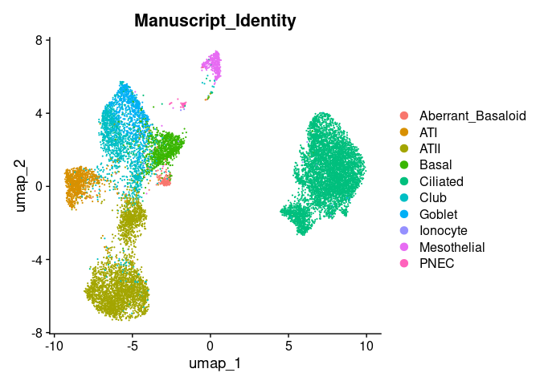<!-- -->

``` r
DimPlot(ipfatlas.basic200.epi.cells, group.by='Subclass_Cell_Identity')
```

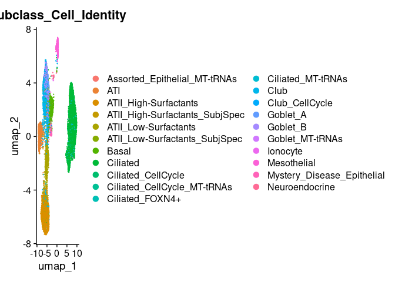<!-- -->

``` r
DimPlot(ipfatlas.basic200.epi.cells, group.by='Subject_Identity')
```

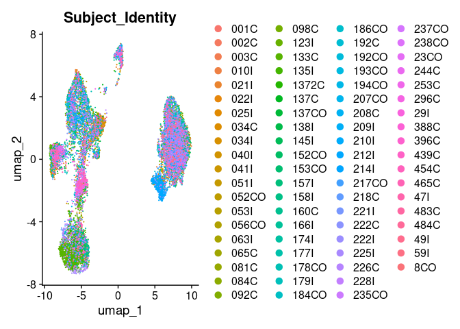<!-- -->

``` r
DimPlot(ipfatlas.basic200.epi.cells, group.by='Disease_Identity')
```

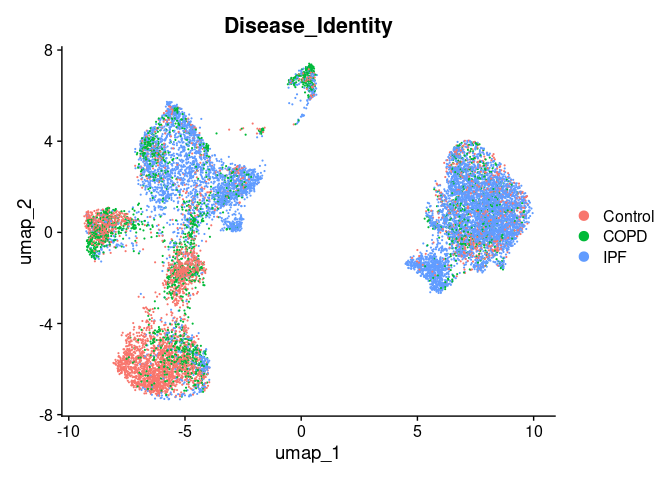<!-- -->

## Subset fibroblasts

``` r
ipfatlas.basic200.fib.cells <- subset(ipfatlas.basic200.cells, subset=CellType_Category=='Stromal')
```

``` r
ipfatlas.basic200.fib.cells <- NormalizeData(ipfatlas.basic200.fib.cells)
```

    ## Normalizing layer: counts

``` r
ipfatlas.basic200.fib.cells <- FindVariableFeatures(ipfatlas.basic200.fib.cells)
```

    ## Finding variable features for layer counts

``` r
ipfatlas.basic200.fib.cells <- ScaleData(ipfatlas.basic200.fib.cells, features=rownames(ipfatlas.basic200.fib.cells))
```

    ## Centering and scaling data matrix

``` r
ipfatlas.basic200.fib.cells <- RunPCA(ipfatlas.basic200.fib.cells)
```

    ## PC_ 1 
    ## Positive:  FBLN1, DCN, LUM, LAMA2, CCDC80, TSHZ2, LSAMP, COL1A2, VCAN, COL1A1 
    ##     ABLIM1, CLU, GPRC5A, COL3A1, SLPI, PID1, RORA, FN1, ENSG00000239268, HAS1 
    ##     MGP, AUTS2, FYN, COL6A2, IL32, SPTBN1, BACH2, SDK1, RORA-AS1, C1orf21 
    ## Negative:  INPP4B, TPM2, MYL9, TM4SF1, CALD1, PRKG1, FAM129A, IGFBP7, SYNE2, MAGI1 
    ##     HOPX, PLCB1, MT1M, FABP4, MT1E, CCL21, GRK5, SPARCL1, ATP10A, CRISPLD2 
    ##     STAT4, NCALD, SLC38A1, A2M, ST6GAL1, EBF1, GRP, CADM1, ADAM19, ZNF385B 
    ## PC_ 2 
    ## Positive:  COL3A1, COL1A1, A2M, PRKG1, NEBL, FN1, COL1A2, MCTP2, LIMCH1, LUM 
    ##     ANK3, LSAMP, TPM2, RORA, LDB2, CALD1, APOE, GNG2, MAST4, KIAA1217 
    ##     HOPX, RORA-AS1, LINC00511, MYL9, IL32, HYDIN, CADM1, HSPA1A, SYNE1, MACROD2 
    ## Negative:  SLPI, GPRC5A, HAS1, MT1M, CLU, ABLIM1, EBF1, MT1X, PID1, MT1E 
    ##     CCDC80, CRISPLD2, MT1G, IFI27, CXCL2, PLCB1, ZNF385B, C1orf21, THBS1, TIMP3 
    ##     SLC38A1, TRAC, CXCL8, DCN, SDK1, RND3, CXCL3, BAG3, FBLN1, SCGB1A1 
    ## PC_ 3 
    ## Positive:  LAMA2, A2M, ENSG00000239268, LIMCH1, MGP, LSAMP, LUM, FBLN1, PID1, DCN 
    ##     ENSG00000283563, NEBL, SPARCL1, RORA, MT1X, CLU, GZMH, S100B, MT1M, SFTPC 
    ##     MZB1, AOAH, KLRC1, CD2, TIMP3, SFTA2, MIR205HG, IL1B, IL2RA, SPTBN1 
    ## Negative:  KIAA1217, MYL9, HSPA1A, TPM2, COL1A1, HSPA1B, ATP10A, AUTS2, BAG3, PLCB1 
    ##     TM4SF1, COL6A2, COL3A1, GPRC5A, IFI27, YES1, COL1A2, SYNE2, HAS1, CALD1 
    ##     FYN, NCALD, MAGI1, SCGB3A1, EBF1, MTCO1P40, VCAN, GRK5, IL32, CEMIP2 
    ## PC_ 4 
    ## Positive:  EBF1, AUTS2, DLC1, PLCB1, ZEB1, GRK5, ENSG00000283563, SLPI, ZNF385B, RORA 
    ##     PARD3, ABLIM1, C1orf21, CALD1, LDB2, FYN, IFI27, LAMA2, SYNE2, NCALD 
    ##     SPTBN1, TSHZ2, ZNF385D, MAST4, ADGRL2, TRAC, INPP4B, PID1, COL1A2, SYNE1 
    ## Negative:  CCL2, MT1X, THBS1, MT1M, MT1E, A2M, CXCL2, CXCL8, LUM, G0S2 
    ##     MT1G, CXCL3, MTND4P12, SCGB1A1, IL32, EMP2, MAMLD1, NEBL, ENSG00000240040, MGP 
    ##     FN1, CRISPLD2, TPM2, SCGB3A1, CEMIP2, LIMCH1, APOE, RND3, IL1RL1, IL1R2 
    ## PC_ 5 
    ## Positive:  ENSG00000283563, A2M, ENSG00000239268, MGP, IGFBP7, SPTBN1, SPARCL1, DLC1, TIMP3, PID1 
    ##     LIMCH1, EMP2, GRK5, SYNE1, MT1M, C1orf21, INPP4B, CRISPLD2, RORA, LAMA2 
    ##     LSAMP, EBF1, PARD3, RORA-AS1, LDB2, MT1X, PRKG1, MT1E, G0S2, ZNF385B 
    ## Negative:  KIAA1217, COL1A1, MTCO1P40, COL3A1, MTND4P12, HAS1, VCAN, COL1A2, CXCL8, GPRC5A 
    ##     TSHZ2, SPP1, CXCL2, ADAM19, CCDC80, ATP10A, AREG, HSPA1B, THBS1, IFI27 
    ##     EREG, ACKR1, CCL20, CXCL5, FN1, COL6A2, WFDC21P, LINC00511, HSPA1A, NEDD4L

``` r
ipfatlas.basic200.fib.cells <- RunUMAP(ipfatlas.basic200.fib.cells, dims=1:30)
```

    ## 12:31:20 UMAP embedding parameters a = 0.9922 b = 1.112

    ## 12:31:20 Read 6430 rows and found 30 numeric columns

    ## 12:31:20 Using Annoy for neighbor search, n_neighbors = 30

    ## 12:31:20 Building Annoy index with metric = cosine, n_trees = 50

    ## 0%   10   20   30   40   50   60   70   80   90   100%

    ## [----|----|----|----|----|----|----|----|----|----|

    ## **************************************************|
    ## 12:31:21 Writing NN index file to temp file /tmp/Rtmp5h6hib/file4953366f5508
    ## 12:31:21 Searching Annoy index using 1 thread, search_k = 3000
    ## 12:31:22 Annoy recall = 100%
    ## 12:31:23 Commencing smooth kNN distance calibration using 1 thread with target n_neighbors = 30
    ## 12:31:24 Initializing from normalized Laplacian + noise (using RSpectra)
    ## 12:31:24 Commencing optimization for 500 epochs, with 273128 positive edges
    ## 12:31:31 Optimization finished

``` r
DimPlot(ipfatlas.basic200.fib.cells, group.by='Manuscript_Identity')
```

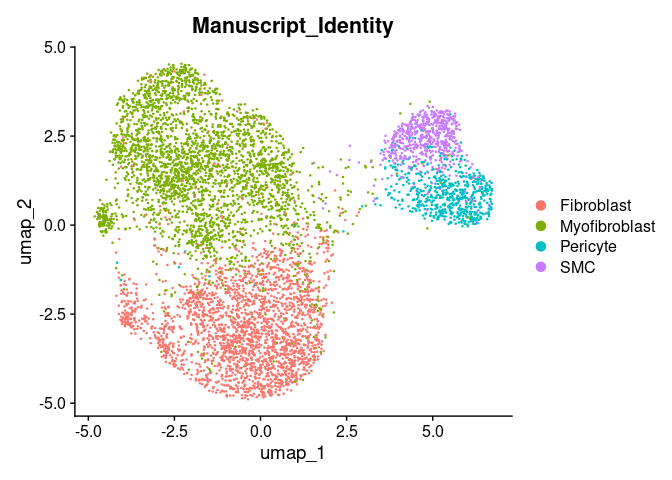<!-- -->

``` r
DimPlot(ipfatlas.basic200.fib.cells, group.by='Subclass_Cell_Identity')
```

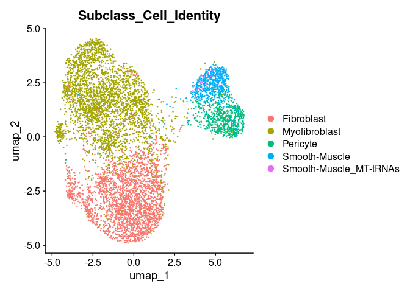<!-- -->

``` r
DimPlot(ipfatlas.basic200.fib.cells, group.by='Subject_Identity')
```

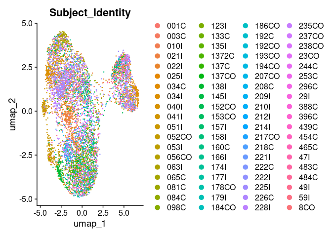<!-- -->

``` r
DimPlot(ipfatlas.basic200.fib.cells, group.by='Disease_Identity')
```

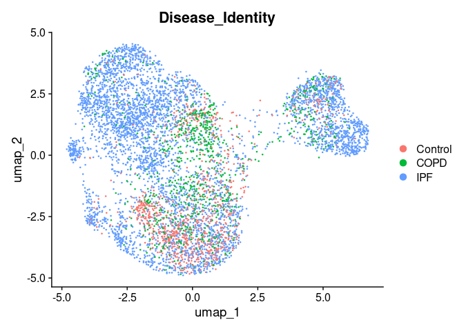<!-- -->

# Simulate SPAPROS high expression panel

Targeted gene expression that is high on the order of KRT7 or COL1A1.
Didn’t do that well on removing too-high expressors. Also allowed
SPAPROS to choose the minimum informative number of genes, so it is
quite small.

``` r
highexpression.genes <- read.csv('SPAPROS-highexpression.csv', header = TRUE)$X
```

``` r
ipfatlas.highexpression.cells <- subset(ipfatlas.cells, features=highexpression.genes)
```

Some genes in the Cosmx panel are not in the IPF dataset. Many of these
genes are listed with a “/” suggesting that the probe cannot distinguish
these isoforms. For simplicity I am not going to clean up the gene list.
So actual list is a bit shorter. These are the missing genes:

``` r
setdiff(highexpression.genes, rownames(ipfatlas.cells))
```

    ## character(0)

## Standard clustering

``` r
ipfatlas.highexpression.cells <- NormalizeData(ipfatlas.highexpression.cells)
```

    ## Normalizing layer: counts

``` r
ipfatlas.highexpression.cells <- FindVariableFeatures(ipfatlas.highexpression.cells)
```

    ## Finding variable features for layer counts

``` r
ipfatlas.highexpression.cells <- ScaleData(ipfatlas.highexpression.cells, features=rownames(ipfatlas.highexpression.cells))
```

    ## Centering and scaling data matrix

``` r
ipfatlas.highexpression.cells <- RunPCA(ipfatlas.highexpression.cells)
```

    ## PC_ 1 
    ## Positive:  CCL5, PPP1R16B, CD247, ITK, CD69, CNOT6L, FYN, GNG2, GZMB, RNF125 
    ##     SLC38A1, IL32, SYNE2, NKG7, CST7, CD3D, CARD11, KLRB1, CEMIP2, GNLY 
    ##     PBX4, CCL4, AOAH, RHOH, ZEB1, INPP4B, FAM129A, CRYBG1, MCTP2, BACH2 
    ## Negative:  MSR1, C1QA, APOC1, C1QB, C1QC, APOE, CXCL3, S100A8, THBS1, FN1 
    ##     CXCL2, FABP4, ENSG00000239268, LSAMP, VCAN, CXCL8, EREG, IL1B, C15orf48, HSPA1A 
    ##     ATP10A, RNASE1, NLRP3, IFI27, PID1, SDS, HSPA1B, FCN1, MT1G, IL1R2 
    ## PC_ 2 
    ## Positive:  PARD3, MAGI1, ENSG00000283563, IGFBP7, EMP2, NEBL, SLPI, GPRC5A, WFDC2, LRRIQ1 
    ##     MGP, NEDD4L, CALD1, HYDIN, PACRG, MYL9, SYNE1, KRT7, ANK3, MT1E 
    ##     FBLN1, TPM2, MT1M, SFTPB, SYNE2, PTPRB, DCN, VWF, AUTS2, MIR205HG 
    ## Negative:  MSR1, AOAH, CRYBG1, C1QC, CCL4, C1QA, C1QB, S100A8, CCL5, NKG7 
    ##     RHOH, CD69, RGS1, AREG, GNG2, APOC1, CD247, GZMB, NLRP3, EREG 
    ##     CXCL3, CST7, FAM129A, ITK, GNLY, IL1B, THBS1, RNF125, CNOT6L, CD3D 
    ## PC_ 3 
    ## Positive:  FABP4, ENSG00000239268, ATP10A, LSAMP, C1QB, C1QA, C1QC, APOC1, FN1, APOE 
    ##     IFI27, MSR1, DCN, FAM129A, CD3D, IL32, CCL5, ITK, CD247, RNF125 
    ##     HSPA1A, CNOT6L, GZMB, HSPA1B, CALD1, SYNE2, KLRB1, PBX4, MGP, GNLY 
    ## Negative:  IL1R2, PID1, NLRP3, FCN1, EREG, AREG, S100A12, VCAN, PLCB1, ADAM28 
    ##     THBS1, S100A8, CXCL8, C15orf48, SDS, IL1B, CXCL2, MCTP2, AFF3, NEDD4L 
    ##     RGS1, RNASE1, MT1X, HAS1, BANK1, SFTPB, TNFRSF13C, ANKRD33B, SFTPA2, GPRC5A 
    ## PC_ 4 
    ## Positive:  LRRIQ1, WFDC2, HYDIN, PACRG, ANK3, SLPI, NEDD4L, NEBL, SFTPB, KRT7 
    ##     SFTPA2, SFTPC, MIR205HG, CADM1, SCGB3A1, GPRC5A, MAGI1, WFDC21P, SYNE1, APOC1 
    ##     NCALD, PARD3, C1QB, C1QC, C1QA, SYNE2, SCGB1A1, MSR1, CXCL3, PBX4 
    ## Negative:  MGP, CALD1, MT1M, DCN, FBLN1, PTPRB, TPM2, MYL9, VWF, ACKR1 
    ##     MT1X, ZEB1, IGFBP7, ENSG00000283563, ZNF385D, FCN3, ADGRL2, PLCB1, MT1E, HAS1 
    ##     CCL21, VCAN, FYN, BACH2, THBS1, IL32, IL1RL1, ANKRD33B, PID1, S100A12 
    ## PC_ 5 
    ## Positive:  TNFRSF13C, AFF3, BANK1, ADAM28, ST6GAL1, ENSG00000240040, BACH2, ZEB1, RHOH, ANKRD33B 
    ##     PBX4, RGS1, MZB1, CD69, PPP1R16B, CRYBG1, IL2RA, SLC38A1, ANK3, S100B 
    ##     INPP4B, WFDC21P, ENSG00000231873, IL1RL1, TPSB2, CNOT6L, CEMIP2, PTPRB, FCN3, VWF 
    ## Negative:  NKG7, GNLY, GZMB, CCL4, CD247, KLRB1, CCL5, AOAH, CST7, MCTP2 
    ##     NCALD, KLRC1, PLCB1, VCAN, S100A8, THBS1, IGFBP7, EREG, FCN1, S100A12 
    ##     CXCL2, MT1X, SYNE1, FYN, CXCL8, AREG, IL1B, MT1E, CXCL3, PID1

``` r
ipfatlas.highexpression.cells <- RunUMAP(ipfatlas.highexpression.cells, dims=1:30)
```

    ## 12:32:21 UMAP embedding parameters a = 0.9922 b = 1.112

    ## 12:32:21 Read 253424 rows and found 30 numeric columns

    ## 12:32:21 Using Annoy for neighbor search, n_neighbors = 30

    ## 12:32:21 Building Annoy index with metric = cosine, n_trees = 50

    ## 0%   10   20   30   40   50   60   70   80   90   100%

    ## [----|----|----|----|----|----|----|----|----|----|

    ## **************************************************|
    ## 12:33:06 Writing NN index file to temp file /tmp/Rtmp5h6hib/file49533fef157f
    ## 12:33:06 Searching Annoy index using 1 thread, search_k = 3000
    ## 12:35:04 Annoy recall = 100%
    ## 12:35:05 Commencing smooth kNN distance calibration using 1 thread with target n_neighbors = 30
    ## 12:35:17 Initializing from normalized Laplacian + noise (using RSpectra)
    ## 12:35:50 Commencing optimization for 200 epochs, with 11884100 positive edges
    ## 12:38:08 Optimization finished

``` r
DimPlot(ipfatlas.highexpression.cells, group.by='CellType_Category')
```

    ## Rasterizing points since number of points exceeds 100,000.
    ## To disable this behavior set `raster=FALSE`

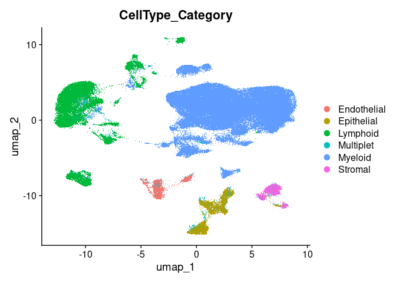<!-- -->

``` r
DimPlot(ipfatlas.highexpression.cells, group.by='Manuscript_Identity')
```

    ## Rasterizing points since number of points exceeds 100,000.
    ## To disable this behavior set `raster=FALSE`

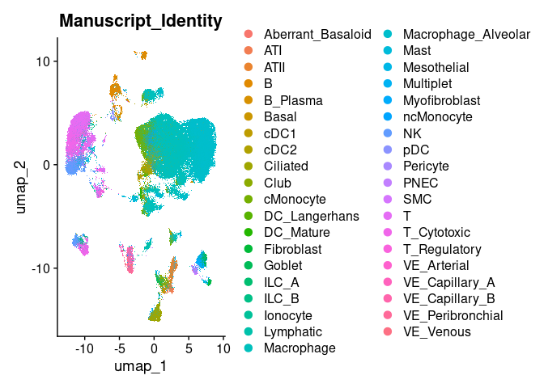<!-- -->

``` r
DimPlot(ipfatlas.highexpression.cells, group.by='Subclass_Cell_Identity')
```

    ## Rasterizing points since number of points exceeds 100,000.
    ## To disable this behavior set `raster=FALSE`

<!-- -->

``` r
DimPlot(ipfatlas.highexpression.cells, group.by='Subject_Identity')
```

    ## Rasterizing points since number of points exceeds 100,000.
    ## To disable this behavior set `raster=FALSE`

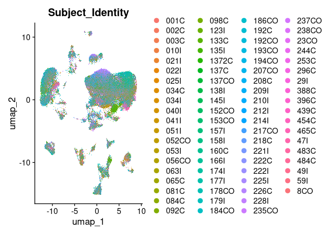<!-- -->

``` r
DimPlot(ipfatlas.highexpression.cells, group.by='Disease_Identity')
```

    ## Rasterizing points since number of points exceeds 100,000.
    ## To disable this behavior set `raster=FALSE`

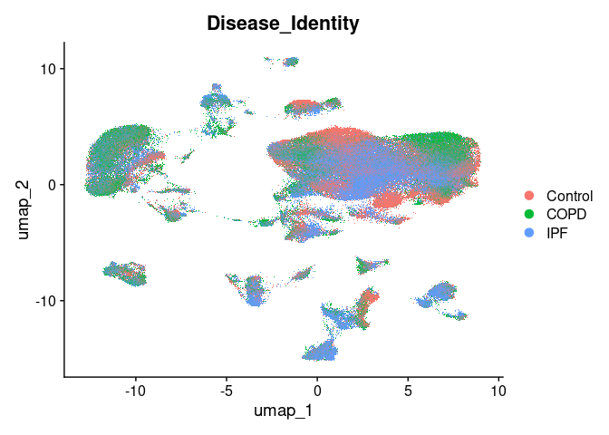<!-- -->

## Subset epithelium

``` r
ipfatlas.highexpression.epi.cells <- subset(ipfatlas.highexpression.cells, subset=CellType_Category=='Epithelial')
```

``` r
ipfatlas.highexpression.epi.cells <- NormalizeData(ipfatlas.highexpression.epi.cells)
```

    ## Normalizing layer: counts

``` r
ipfatlas.highexpression.epi.cells <- FindVariableFeatures(ipfatlas.highexpression.epi.cells)
```

    ## Finding variable features for layer counts

``` r
ipfatlas.highexpression.epi.cells <- ScaleData(ipfatlas.highexpression.epi.cells, features=rownames(ipfatlas.highexpression.epi.cells))
```

    ## Centering and scaling data matrix

``` r
ipfatlas.highexpression.epi.cells <- RunPCA(ipfatlas.highexpression.epi.cells)
```

    ## PC_ 1 
    ## Positive:  SFTPB, SFTPA2, CXCL2, SFTPC, RNASE1, AFF3, CXCL8, CADM1, GPRC5A, PID1 
    ##     CEMIP2, AREG, CXCL3, MT1X, KRT7, MT1G, AUTS2, IL32, SLC38A1, MYL9 
    ##     MGP, FAM129A, SCGB3A1, MT1M, BANK1, EREG, MCTP2, HAS1, ENSG00000240040, MT1E 
    ## Negative:  LRRIQ1, HYDIN, PACRG, IGFBP7, NCALD, SYNE2, SYNE1, ANK3, MAGI1, INPP4B 
    ##     PARD3, WFDC21P, IFI27, WFDC2, PBX4, HSPA1A, MTND4P12, ST6GAL1, NEBL, HSPA1B 
    ##     FYN, PLCB1, FN1, FCN3, APOE, SLPI, CNOT6L, ZNF385D, C1QA, NEDD4L 
    ## PC_ 2 
    ## Positive:  SFTPC, SFTPA2, AFF3, ANK3, SYNE1, LRRIQ1, HYDIN, PACRG, SLPI, SFTPB 
    ##     NCALD, AUTS2, CXCL3, CXCL2, WFDC21P, PID1, NEBL, MAGI1, PBX4, KLRC1 
    ##     FCN3, MZB1, APOC1, S100A12, GRP, S100B, SCGB3A1, CD3D, CXCL8, TPSB2 
    ## Negative:  CALD1, HAS1, ENSG00000283563, MT1X, KRT7, MT1M, GPRC5A, BACH2, TPM2, MYL9 
    ##     IL32, LSAMP, MIR205HG, DCN, FBLN1, PLCB1, MT1E, MGP, MCTP2, ANKRD33B 
    ##     FN1, IFI27, ATP10A, VCAN, ZEB1, FYN, ENSG00000239268, CARD11, EMP2, ADGRL2 
    ## PC_ 3 
    ## Positive:  SCGB1A1, SCGB3A1, SLPI, MGP, HAS1, MT1M, WFDC2, TPM2, MT1X, ADAM28 
    ##     CXCL8, DCN, PLCB1, MT1G, ENSG00000239268, BACH2, PPP1R16B, MT1E, ZEB1, CALD1 
    ##     WFDC21P, FAM129A, LSAMP, MTND4P12, ANKRD33B, ACKR1, INPP4B, APOC1, CXCL3, FBLN1 
    ## Negative:  CADM1, NEDD4L, EMP2, MAGI1, NEBL, PARD3, IL32, GPRC5A, MYL9, SYNE1 
    ##     KRT7, ANK3, CEMIP2, BANK1, AFF3, ENSG00000283563, SFTPB, PID1, HSPA1B, ATP10A 
    ##     AUTS2, HSPA1A, RNASE1, SYNE2, BAG3, SLC38A1, SFTPC, IGFBP7, ST6GAL1, CNOT6L 
    ## PC_ 4 
    ## Positive:  SCGB1A1, KRT7, SCGB3A1, IL32, ENSG00000283563, ADAM28, RNASE1, MYL9, EMP2, GPRC5A 
    ##     WFDC2, ATP10A, FAM129A, MGP, MIR205HG, SFTPB, C15orf48, PPP1R16B, INPP4B, NEBL 
    ##     ST6GAL1, CARD11, SYNE2, NEDD4L, IFI27, RNF125, S100B, TNFRSF13C, KLRC1, CADM1 
    ## Negative:  SFTPC, AUTS2, MT1E, HAS1, AFF3, SYNE1, SFTPA2, MT1M, AREG, MT1G 
    ##     MT1X, CXCL2, ANK3, PID1, LSAMP, CXCL3, PLCB1, TPM2, ZEB1, CALD1 
    ##     DCN, CEMIP2, HSPA1A, ENSG00000239268, SLPI, HSPA1B, MCTP2, BAG3, PARD3, CXCL8 
    ## PC_ 5 
    ## Positive:  WFDC2, SLPI, RNASE1, SCGB3A1, WFDC21P, CXCL3, APOC1, CXCL8, IFI27, KRT7 
    ##     SFTPA2, C15orf48, APOE, MT1E, SCGB1A1, CXCL2, IL32, HSPA1A, C1QB, EMP2 
    ##     SFTPC, AREG, HSPA1B, INPP4B, ST6GAL1, IGFBP7, C1QA, FN1, S100A8, MT1X 
    ## Negative:  HAS1, CALD1, PLCB1, ENSG00000239268, ZEB1, ENSG00000283563, BACH2, MT1M, MCTP2, ANKRD33B 
    ##     DCN, CEMIP2, TPM2, LSAMP, PARD3, GRP, GPRC5A, IL1RL1, ENSG00000240040, ATP10A 
    ##     AFF3, CADM1, AOAH, NEDD4L, GNG2, RNF125, MIR205HG, FYN, MAGI1, ACKR1

``` r
ipfatlas.highexpression.epi.cells <- RunUMAP(ipfatlas.highexpression.epi.cells, dims=1:30)
```

    ## 12:38:30 UMAP embedding parameters a = 0.9922 b = 1.112

    ## 12:38:30 Read 13370 rows and found 30 numeric columns

    ## 12:38:30 Using Annoy for neighbor search, n_neighbors = 30

    ## 12:38:30 Building Annoy index with metric = cosine, n_trees = 50

    ## 0%   10   20   30   40   50   60   70   80   90   100%

    ## [----|----|----|----|----|----|----|----|----|----|

    ## **************************************************|
    ## 12:38:32 Writing NN index file to temp file /tmp/Rtmp5h6hib/file495335af94a5d
    ## 12:38:32 Searching Annoy index using 1 thread, search_k = 3000
    ## 12:38:36 Annoy recall = 100%
    ## 12:38:36 Commencing smooth kNN distance calibration using 1 thread with target n_neighbors = 30
    ## 12:38:37 Initializing from normalized Laplacian + noise (using RSpectra)
    ## 12:38:38 Commencing optimization for 200 epochs, with 596406 positive edges
    ## 12:38:44 Optimization finished

``` r
DimPlot(ipfatlas.highexpression.epi.cells, group.by='Manuscript_Identity')
```

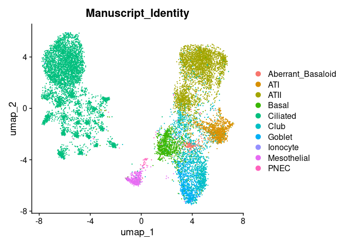<!-- -->

``` r
DimPlot(ipfatlas.highexpression.epi.cells, group.by='Subclass_Cell_Identity')
```

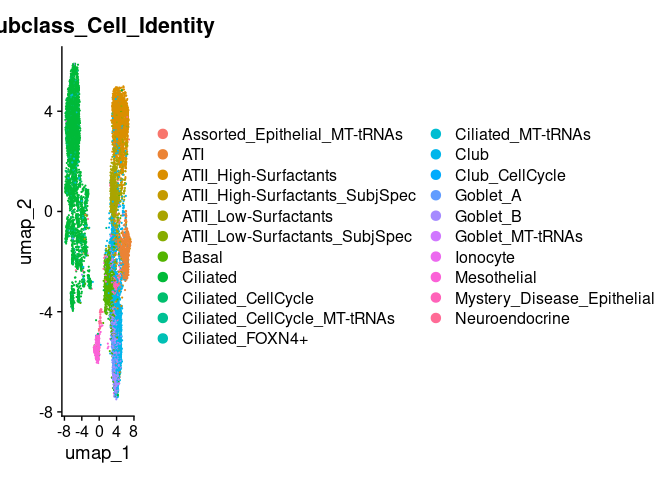<!-- -->

``` r
DimPlot(ipfatlas.highexpression.epi.cells, group.by='Subject_Identity')
```

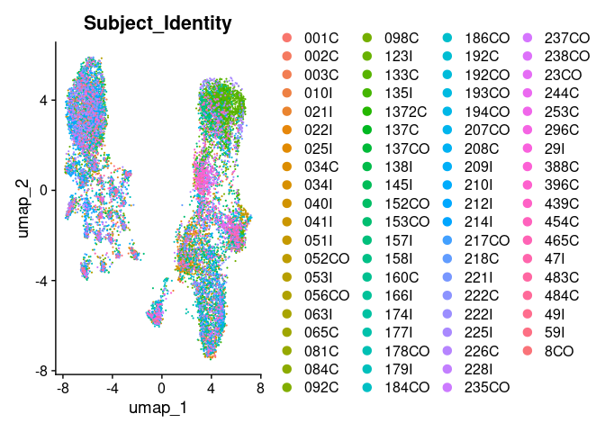<!-- -->

``` r
DimPlot(ipfatlas.highexpression.epi.cells, group.by='Disease_Identity')
```

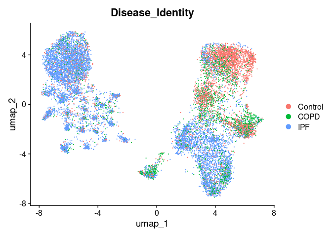<!-- -->

## Subset fibroblasts

``` r
ipfatlas.highexpression.fib.cells <- subset(ipfatlas.highexpression.cells, subset=CellType_Category=='Stromal')
```

``` r
ipfatlas.highexpression.fib.cells <- NormalizeData(ipfatlas.highexpression.fib.cells)
```

    ## Normalizing layer: counts

``` r
ipfatlas.highexpression.fib.cells <- FindVariableFeatures(ipfatlas.highexpression.fib.cells)
```

    ## Finding variable features for layer counts

``` r
ipfatlas.highexpression.fib.cells <- ScaleData(ipfatlas.highexpression.fib.cells, features=rownames(ipfatlas.highexpression.fib.cells))
```

    ## Centering and scaling data matrix

``` r
ipfatlas.highexpression.fib.cells <- RunPCA(ipfatlas.highexpression.fib.cells)
```

    ## PC_ 1 
    ## Positive:  INPP4B, TPM2, MYL9, CALD1, FAM129A, IGFBP7, MAGI1, SYNE2, PLCB1, CCL21 
    ##     FABP4, ATP10A, NCALD, MT1E, ST6GAL1, SLC38A1, MT1M, CADM1, GRP, MCTP2 
    ##     ADGRL2, AFF3, APOE, PBX4, WFDC2, TPSB2, ENSG00000240040, GZMB, KRT7, CNOT6L 
    ## Negative:  FBLN1, DCN, LSAMP, GPRC5A, SLPI, VCAN, PID1, HAS1, MGP, ENSG00000239268 
    ##     FYN, BACH2, FN1, CXCL2, AUTS2, IL32, ZNF385D, NEBL, CXCL8, IFI27 
    ##     MT1G, CXCL3, THBS1, ANKRD33B, BAG3, SYNE1, APOC1, SCGB1A1, ZEB1, MT1X 
    ## PC_ 2 
    ## Positive:  NEBL, FN1, LSAMP, MCTP2, ANK3, CALD1, GNG2, APOE, SYNE1, HSPA1A 
    ##     TPM2, VCAN, HSPA1B, AUTS2, ENSG00000239268, IL32, HYDIN, ZEB1, BACH2, PARD3 
    ##     CNOT6L, ADGRL2, EMP2, CADM1, MAGI1, NEDD4L, ENSG00000283563, MYL9, PACRG, AFF3 
    ## Negative:  MT1M, MT1X, SLPI, HAS1, MT1E, GPRC5A, MT1G, CXCL2, IFI27, PLCB1 
    ##     THBS1, SLC38A1, PID1, CXCL8, FAM129A, SCGB1A1, CXCL3, ATP10A, SCGB3A1, SFTPC 
    ##     SFTPA2, IL1RL1, ENSG00000231873, S100A8, SFTPB, S100A12, FABP4, BAG3, IL1B, C15orf48 
    ## PC_ 3 
    ## Positive:  ENSG00000239268, ENSG00000283563, MGP, LSAMP, PID1, NEBL, FBLN1, DCN, KLRC1, S100B 
    ##     MZB1, MIR205HG, AOAH, GRP, KLRB1, ZNF385D, IL2RA, HYDIN, CD3D, SFTPA2 
    ##     CCL5, TNFRSF13C, LRRIQ1, TPSB2, MSR1, IL1B, SFTPC, INPP4B, S100A12, PTPRB 
    ## Negative:  BAG3, GPRC5A, MYL9, CXCL2, ATP10A, TPM2, MT1E, HSPA1A, HSPA1B, CEMIP2 
    ##     SCGB3A1, SCGB1A1, HAS1, CXCL8, IL32, THBS1, VCAN, IFI27, PLCB1, FYN 
    ##     SYNE2, AUTS2, CXCL3, MAGI1, NCALD, ANKRD33B, APOE, AREG, FAM129A, PARD3 
    ## PC_ 4 
    ## Positive:  HSPA1B, PLCB1, HSPA1A, AUTS2, HAS1, IFI27, GPRC5A, SLPI, ZEB1, BAG3 
    ##     NCALD, FYN, PARD3, SYNE2, ANKRD33B, ATP10A, ENSG00000283563, C1QC, CALD1, ZNF385D 
    ##     ADGRL2, ST6GAL1, SDS, BACH2, PID1, S100A12, VCAN, C1QA, GRP, LRRIQ1 
    ## Negative:  MT1X, MT1M, MT1E, MT1G, SCGB1A1, NEBL, MGP, SCGB3A1, FN1, LSAMP 
    ##     MTND4P12, ENSG00000239268, IL32, ENSG00000240040, THBS1, EMP2, CCL21, TPM2, GZMB, APOE 
    ##     IGFBP7, MCTP2, ANK3, GNG2, RHOH, RGS1, CCL5, FBLN1, IL1R2, MYL9 
    ## PC_ 5 
    ## Positive:  HSPA1B, HSPA1A, BAG3, CXCL2, CXCL8, CXCL3, APOE, THBS1, EMP2, ANKRD33B 
    ##     CEMIP2, NEBL, IL1R2, TPSB2, GPRC5A, IL1RL1, TPM2, IGFBP7, MCTP2, IL2RA 
    ##     IL32, MT1X, FCN3, ENSG00000240040, MT1E, MT1M, NEDD4L, IL1B, MGP, C15orf48 
    ## Negative:  ZEB1, SCGB1A1, PLCB1, SCGB3A1, ENSG00000283563, AUTS2, SLPI, SYNE1, ATP10A, AFF3 
    ##     IFI27, CALD1, ZNF385D, PARD3, BACH2, SYNE2, PID1, APOC1, FN1, NCALD 
    ##     FYN, ENSG00000239268, CRYBG1, FAM129A, CNOT6L, ADGRL2, ITK, WFDC2, FABP4, VCAN

``` r
ipfatlas.highexpression.fib.cells <- RunUMAP(ipfatlas.highexpression.fib.cells, dims=1:30)
```

    ## 12:38:53 UMAP embedding parameters a = 0.9922 b = 1.112

    ## 12:38:53 Read 6430 rows and found 30 numeric columns

    ## 12:38:53 Using Annoy for neighbor search, n_neighbors = 30

    ## 12:38:53 Building Annoy index with metric = cosine, n_trees = 50

    ## 0%   10   20   30   40   50   60   70   80   90   100%

    ## [----|----|----|----|----|----|----|----|----|----|

    ## **************************************************|
    ## 12:38:54 Writing NN index file to temp file /tmp/Rtmp5h6hib/file49533296ccd9c
    ## 12:38:54 Searching Annoy index using 1 thread, search_k = 3000
    ## 12:38:56 Annoy recall = 100%
    ## 12:38:56 Commencing smooth kNN distance calibration using 1 thread with target n_neighbors = 30
    ## 12:38:57 Initializing from normalized Laplacian + noise (using RSpectra)
    ## 12:38:57 Commencing optimization for 500 epochs, with 260566 positive edges
    ## 12:39:04 Optimization finished

``` r
DimPlot(ipfatlas.highexpression.fib.cells, group.by='Manuscript_Identity')
```

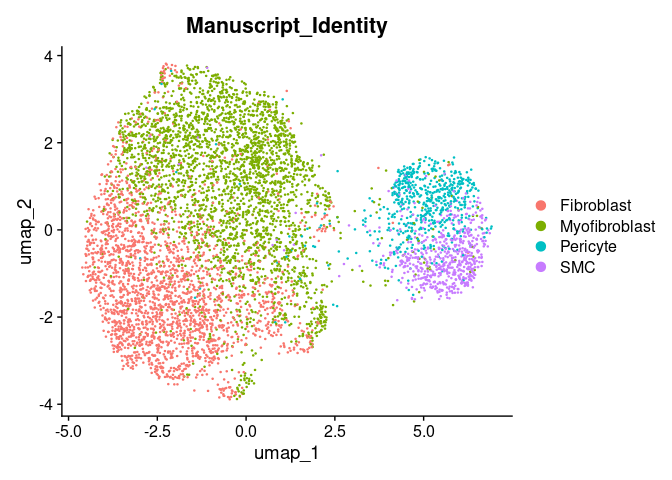<!-- -->

``` r
DimPlot(ipfatlas.highexpression.fib.cells, group.by='Subclass_Cell_Identity')
```

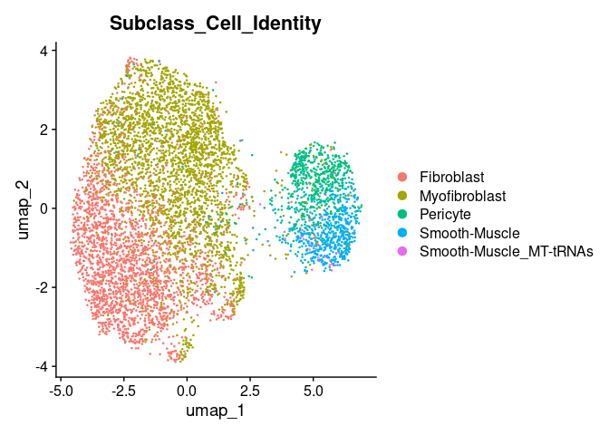<!-- -->

``` r
DimPlot(ipfatlas.highexpression.fib.cells, group.by='Subject_Identity')
```

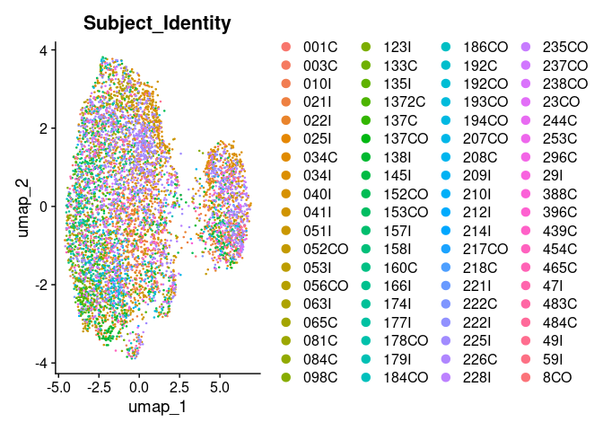<!-- -->

``` r
DimPlot(ipfatlas.highexpression.fib.cells, group.by='Disease_Identity')
```

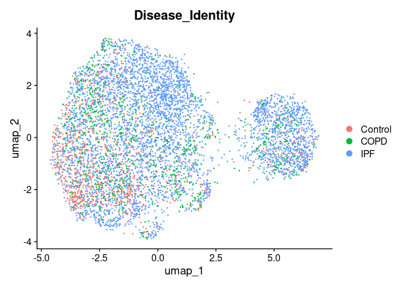<!-- -->
