# Proliferating fibroblasts on 0020227 for Chris

-   [Environment](#environment)
    -   [Read in Xenium](#read-in-xenium)
-   [General processing on 0020227](#general-processing-on-0020227)
    -   [Filter](#filter)
    -   [Standard Processing](#standard-processing)
    -   [Modified Clustering](#modified-clustering)
-   [Proliferation (general)](#proliferation-general)
-   [Fibroblast subset](#fibroblast-subset)
    -   [Recluster](#recluster)
    -   [Recluster after pruning](#recluster-after-pruning)
    -   [Marker learning](#marker-learning)
    -   [Generate assignments file for Xenium Explorer](#generate-assignments-file-for-xenium-explorer)

# Environment

``` r
library(Seurat)
```

```         
## Loading required package: SeuratObject

## Loading required package: sp

## 'SeuratObject' was built under R 4.3.0 but the current version is
## 4.3.2; it is recomended that you reinstall 'SeuratObject' as the ABI
## for R may have changed

## 
## Attaching package: 'SeuratObject'

## The following object is masked from 'package:base':
## 
##     intersect
```

``` r
library(tidyverse)
```

```         
## ── Attaching core tidyverse packages ──────────────────────── tidyverse 2.0.0 ──
## ✔ dplyr     1.1.4     ✔ readr     2.1.5
## ✔ forcats   1.0.0     ✔ stringr   1.5.1
## ✔ ggplot2   3.4.4     ✔ tibble    3.2.1
## ✔ lubridate 1.9.3     ✔ tidyr     1.3.1
## ✔ purrr     1.0.2

## ── Conflicts ────────────────────────────────────────── tidyverse_conflicts() ──
## ✖ dplyr::filter() masks stats::filter()
## ✖ dplyr::lag()    masks stats::lag()
## ℹ Use the conflicted package (<http://conflicted.r-lib.org/>) to force all conflicts to become errors
```

## Read in Xenium

``` r
ipf3.xen <- LoadXenium('output-XETG00143__0020227__Region_1__20231214__022306/')
```

# General processing on 0020227

## Filter

On the theory that if there was only few features, but they had counts,
it is probably still interpretable.

``` r
ipf3.filtered.xen <- subset(ipf3.xen, subset=nCount_Xenium>20 & nFeature_Xenium>4)
```


``` r
print('original dataset:')
```

```         
## [1] "original dataset:"
```

``` r
print(ncol(ipf3.xen))
```

```         
## [1] 580730
```

``` r
print('filtered dataset:')
```

```         
## [1] "filtered dataset:"
```

``` r
print(ncol(ipf3.filtered.xen))
```

```         
## [1] 158303
```

``` r
# cleanup cleanup
rm(ipf3.xen)
gc()
```

```         
##            used  (Mb) gc trigger   (Mb)  max used   (Mb)
## Ncells 11715065 625.7   84533664 4514.6 105667080 5643.3
## Vcells 60942580 465.0  274273042 2092.6 356945820 2723.3
```

## Standard Processing

``` r
DefaultAssay(ipf3.filtered.xen) <- 'Xenium'
ipf3.filtered.xen <- NormalizeData(ipf3.filtered.xen, verbose=F)
ipf3.filtered.xen <- FindVariableFeatures(ipf3.filtered.xen, verbose=F) # defaults to finding 2000, which would be all of them, but downstream expects this.
ipf3.filtered.xen <- ScaleData(ipf3.filtered.xen, verbose=F)
ipf3.filtered.xen <- RunPCA(ipf3.filtered.xen, npcs = 30, features = rownames(ipf3.filtered.xen), verbose=F)
ipf3.filtered.xen <- RunUMAP(ipf3.filtered.xen, dims = 1:30, verbose=F)
```

```         
## Warning: The default method for RunUMAP has changed from calling Python UMAP via reticulate to the R-native UWOT using the cosine metric
## To use Python UMAP via reticulate, set umap.method to 'umap-learn' and metric to 'correlation'
## This message will be shown once per session
```

## Modified Clustering

Modification to reduce cluster number. i think the sparsity of data
means that pruned edges leads to more communities. Major change is the
prune.SNN parameter.

``` r
ipf3.filtered.xen <- FindNeighbors(ipf3.filtered.xen, reduction='pca', dims=1:30, prune.SNN=0) 
```

```         
## Computing nearest neighbor graph

## Computing SNN
```

``` r
ipf3.filtered.xen <- FindClusters(ipf3.filtered.xen, resolution = 0.6)
```

```         
## Modularity Optimizer version 1.3.0 by Ludo Waltman and Nees Jan van Eck
## 
## Number of nodes: 158303
## Number of edges: 34314140
## 
## Running Louvain algorithm...
## Maximum modularity in 10 random starts: 0.8555
## Number of communities: 16
## Elapsed time: 353 seconds
```

``` r
DimPlot(ipf3.filtered.xen, label=T)
```

```         
## Rasterizing points since number of points exceeds 100,000.
## To disable this behavior set `raster=FALSE`
```

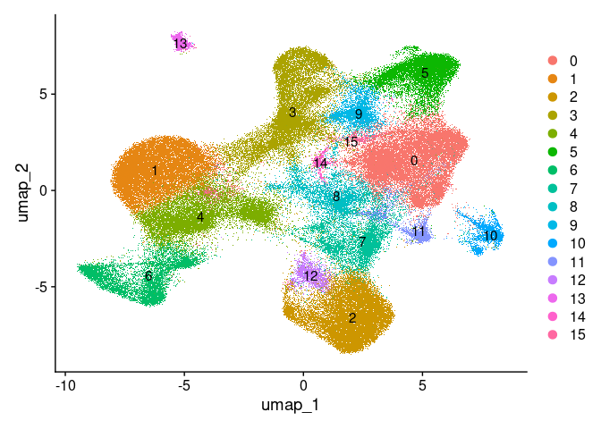<!-- -->

# Proliferation (general)

10X core set includes: CCNA1, CCNB2, CDK1, CENPF, KIT, MKI67, PCNA,
TOP2A.

``` r
FeaturePlot(ipf3.filtered.xen, features=c('COL1A1','CTHRC1','SCN7A','PLA2G2A'),
            min.cutoff='q25', max.cutoff='q90', order=T)
```

<!-- -->

``` r
FeaturePlot(ipf3.filtered.xen, features=c('RGS5','MYH11','CNN1','SFRP2'),
            min.cutoff='q25', max.cutoff='q90', order=T)
```


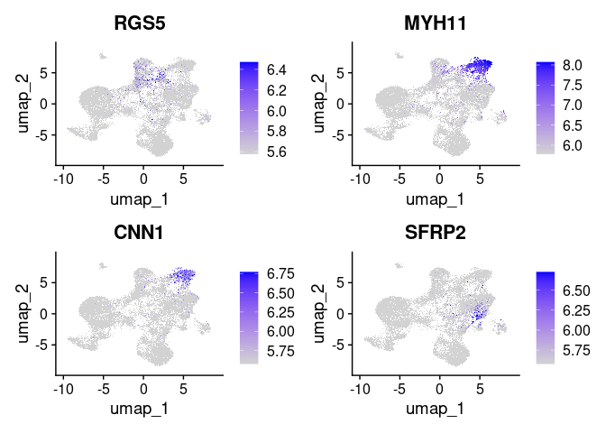<!-- -->

``` r
FeaturePlot(ipf3.filtered.xen, features=c('CCNA1','CCNB2','CDK1','CENPF'),
            min.cutoff='q25', max.cutoff='q90', order=T)
```


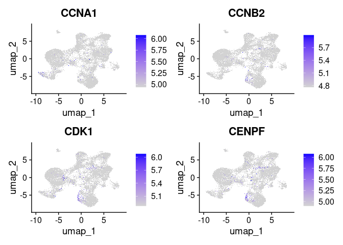<!-- -->

``` r
FeaturePlot(ipf3.filtered.xen, features=c('KIT','MKI67','PCNA','TOP2A'),
            min.cutoff='q25', max.cutoff='q90', order=T)
```


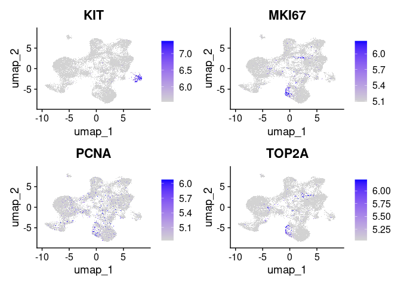<!-- -->

``` r
p <- DotPlot(ipf3.filtered.xen, features=c('EPCAM','ITGB6',
                                           'COL1A1','CTHRC1','SCN7A','PLA2G2A','RGS5','MFAP5','PI16','MYH11','CNN1','SFRP2',
                                      'CCNA1','CCNB2','CDK1','CENPF','KIT','MKI67','PCNA','TOP2A'))
p + coord_flip() + scale_x_discrete(limits = rev)
```

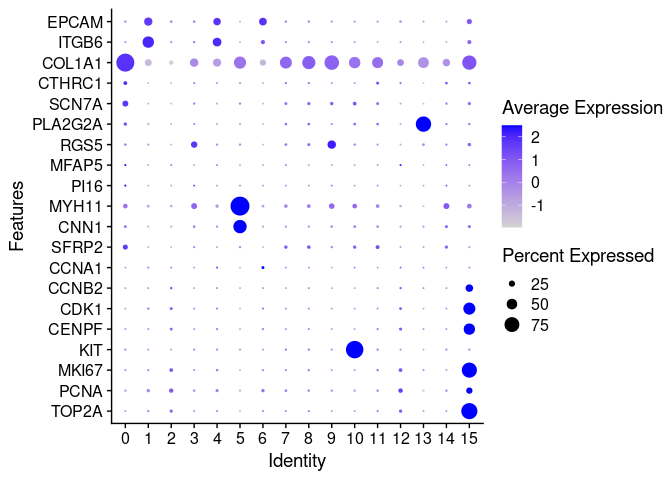<!-- -->


# Fibroblast subset

``` r
ipf3.fib.xen <- subset(ipf3.filtered.xen, idents=c(0,5,9,15))
```


``` r
DimPlot(ipf3.fib.xen, label=T)
```

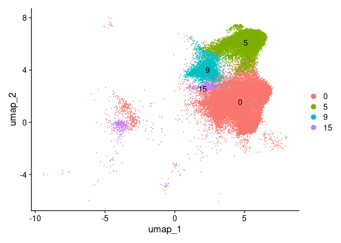<!-- -->

As usual I think the cell cycle signal is strong enough that it forced
all proliferative cells into cluster 15 across different cell types.
Proceed and prune later.

## Recluster

``` r
ipf3.fib.xen <- NormalizeData(ipf3.fib.xen, verbose=F)
ipf3.fib.xen <- FindVariableFeatures(ipf3.fib.xen, verbose=F) # defaults to finding 2000, which would be all of them, but downstream expects this.
ipf3.fib.xen <- ScaleData(ipf3.fib.xen, verbose=F)
ipf3.fib.xen <- RunPCA(ipf3.fib.xen, npcs = 30, features = rownames(ipf3.filtered.xen), verbose=F)
ipf3.fib.xen <- RunUMAP(ipf3.fib.xen, dims = 1:30, verbose=F)
```

``` r
ipf3.fib.xen <- FindNeighbors(ipf3.fib.xen, reduction='pca', dims=1:30, prune.SNN=0) 
```

```         
## Computing nearest neighbor graph

## Computing SNN
```

``` r
ipf3.fib.xen <- FindClusters(ipf3.fib.xen, resolution = 1)
```


``` r
DimPlot(ipf3.fib.xen, label=T)
```

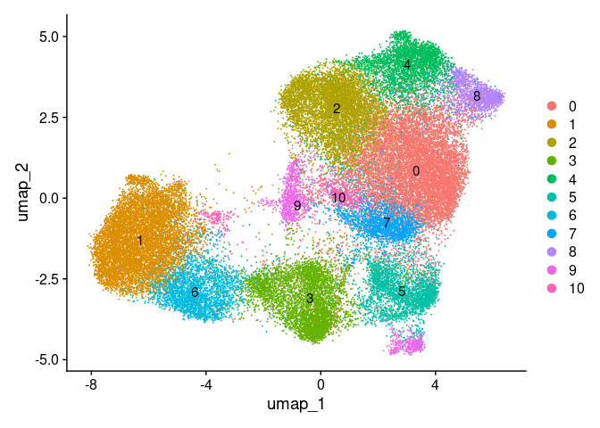<!-- -->

Those fucking proliferative cells, EPCAM+ and COL1+ lumped together in
cluster 9. Really justifies why regression is useful. Try higher res
first.

``` r
ipf3.fib.xen <- FindClusters(ipf3.fib.xen, resolution = 2)
```


``` r
DimPlot(ipf3.fib.xen, label=T)
```

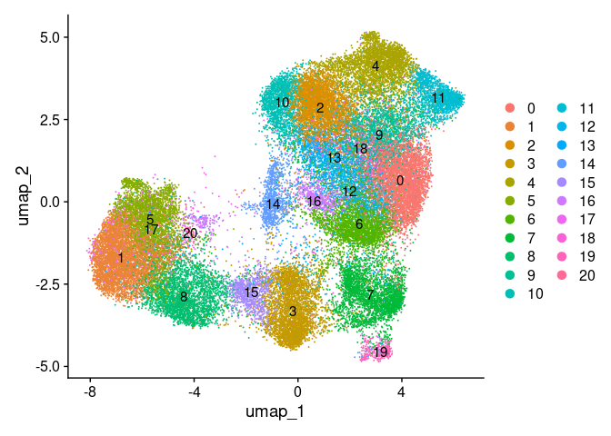<!-- -->

``` r
FeaturePlot(ipf3.fib.xen, features=c('EPCAM','ITGB6','ABCA3','INMT'),
            min.cutoff='q25', max.cutoff='q90', order=T)
```

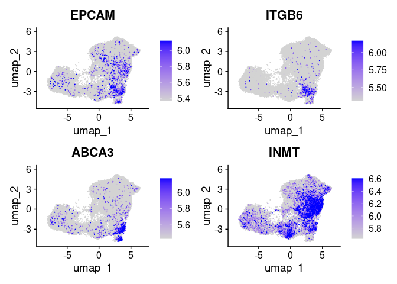<!-- -->

``` r
FeaturePlot(ipf3.fib.xen, features=c('COL1A1','CTHRC1','SCN7A','PLA2G2A'),
            min.cutoff='q25', max.cutoff='q90', order=T)
```

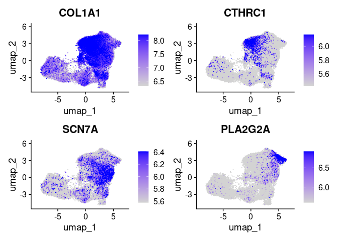<!-- -->

``` r
FeaturePlot(ipf3.fib.xen, features=c('RGS5','MYH11','CNN1','SFRP2'),
            min.cutoff='q25', max.cutoff='q90', order=T)
```

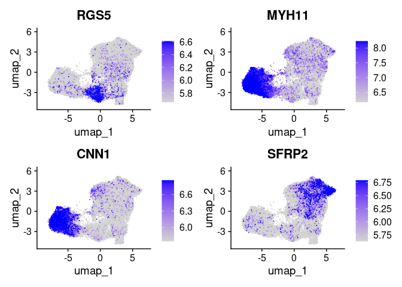<!-- -->

``` r
FeaturePlot(ipf3.fib.xen, features=c('CCNA1','CCNB2','CDK1','CENPF'),
            min.cutoff='q25', max.cutoff='q90', order=T)
```

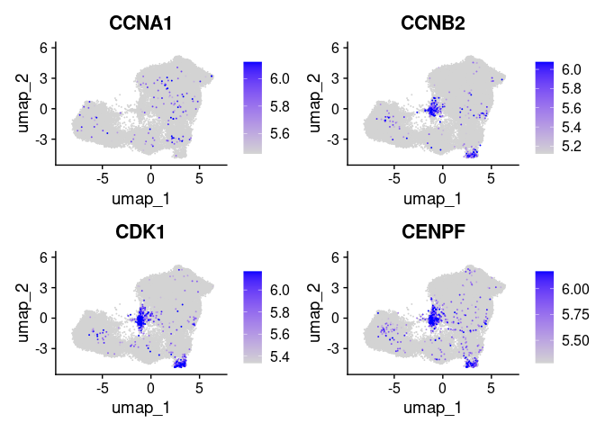<!-- -->

``` r
FeaturePlot(ipf3.fib.xen, features=c('KIT','MKI67','PCNA','TOP2A'),
            min.cutoff='q25', max.cutoff='q90', order=T)
```

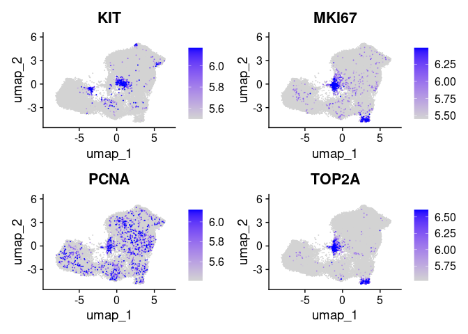<!-- -->

Whew. Drop cluster 19 and 7, these got roped in here probably because
they are DATPs that express some collagen or proliferative epithelium.
One is almost certainly AT2 (ABCA3/KRT8/ITGB6 positive) and the other is
proliferative epithelial.

``` r
ipf3.fib.xen <- subset(x = ipf3.fib.xen, idents = c(7,19), invert = TRUE)
```


## Recluster after pruning

``` r
ipf3.fib.xen <- NormalizeData(ipf3.fib.xen, verbose=F)
ipf3.fib.xen <- FindVariableFeatures(ipf3.fib.xen, verbose=F) # defaults to finding 2000, which would be all of them, but downstream expects this.
ipf3.fib.xen <- ScaleData(ipf3.fib.xen, verbose=F)
ipf3.fib.xen <- RunPCA(ipf3.fib.xen, npcs = 30, features = rownames(ipf3.filtered.xen), verbose=F)
ipf3.fib.xen <- RunUMAP(ipf3.fib.xen, dims = 1:30, verbose=F)
```

``` r
ipf3.fib.xen <- FindNeighbors(ipf3.fib.xen, reduction='pca', dims=1:30, prune.SNN=0, verbose=F) 
ipf3.fib.xen <- FindClusters(ipf3.fib.xen, resolution = 1.5, verbose=F)
```

``` r
DimPlot(ipf3.fib.xen, label=T)
```

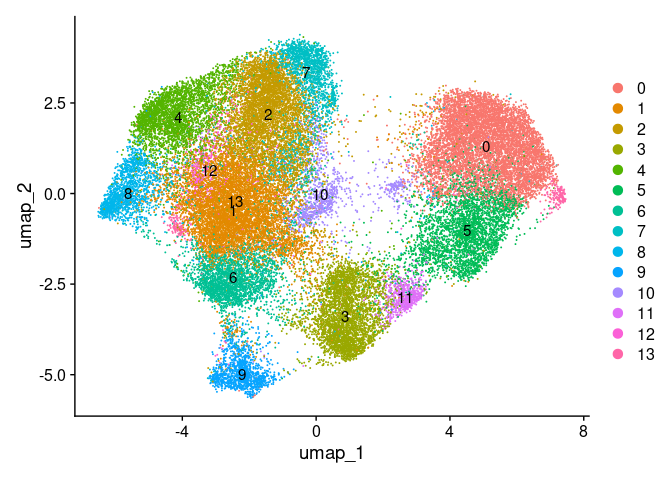<!-- -->

``` r
FeaturePlot(ipf3.fib.xen, features=c('COL1A1','CTHRC1','POSTN','SCN7A'),
            min.cutoff='q25', max.cutoff='q90', order=T)
```

<!-- -->

``` r
FeaturePlot(ipf3.fib.xen, features=c('INMT','RGS5','MYH11','CNN1'),
            min.cutoff='q25', max.cutoff='q90', order=T)
```

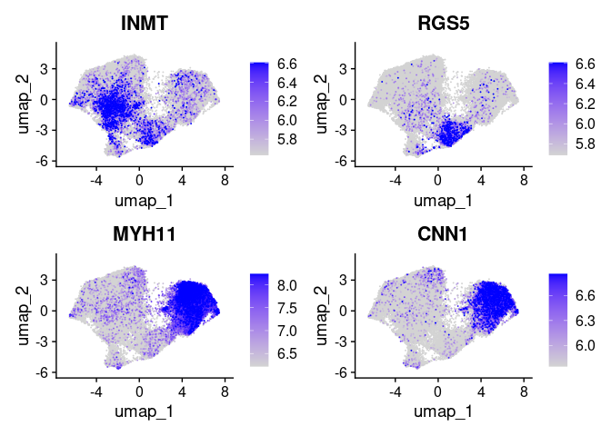<!-- -->

``` r
FeaturePlot(ipf3.fib.xen, features=c('SFRP2','PLA2G2A','MFAP5','PI16'),
            min.cutoff='q25', max.cutoff='q90', order=T)
```

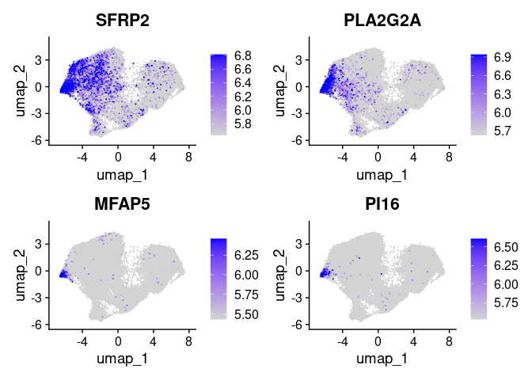<!-- -->

``` r
FeaturePlot(ipf3.fib.xen, features=c('LGR5','WNT5A'),
            min.cutoff='q25', max.cutoff='q90', order=T)
```

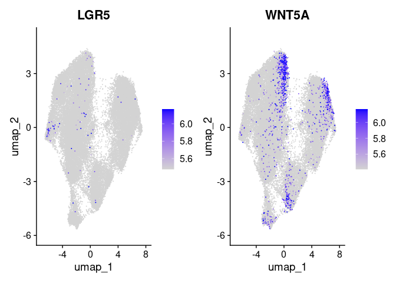<!-- -->

``` r
FeaturePlot(ipf3.fib.xen, features=c('CCNA1','CCNB2','CDK1','CENPF'),
            min.cutoff='q25', max.cutoff='q90', order=T)
```

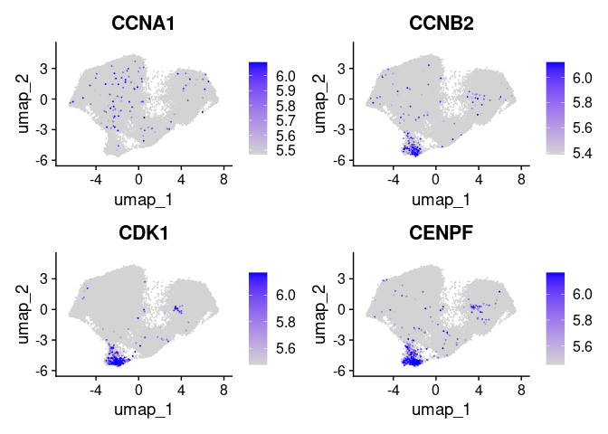<!-- -->

``` r
FeaturePlot(ipf3.fib.xen, features=c('KIT','MKI67','PCNA','TOP2A'),
            min.cutoff='q25', max.cutoff='q90', order=T)
```

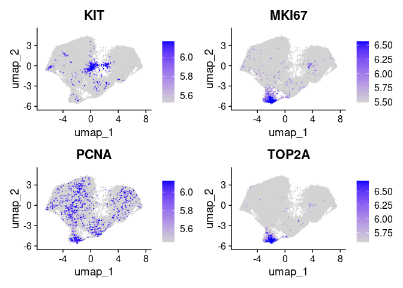<!-- -->

``` r
FeaturePlot(ipf3.fib.xen, features=c('LTBP2','COL5A2','COL8A1','DPP6'),
            min.cutoff='q25', max.cutoff='q90', order=T)
```

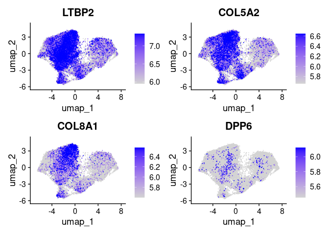<!-- -->

``` r
FeaturePlot(ipf3.fib.xen, features=c('APOD','MFAP5','FBN1','FGFR4'),
            min.cutoff='q25', max.cutoff='q90', order=T)
```

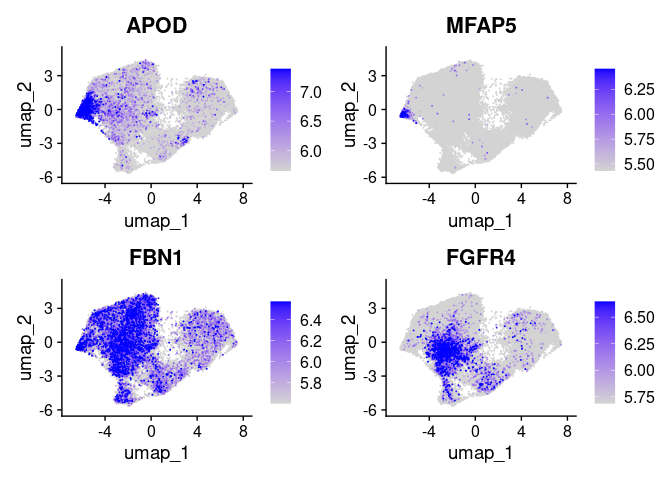<!-- -->

``` r
FeaturePlot(ipf3.fib.xen, features=c('PCOLCE2','PDGFRA','SFRP2','SVEP1'),
            min.cutoff='q25', max.cutoff='q90', order=T)
```

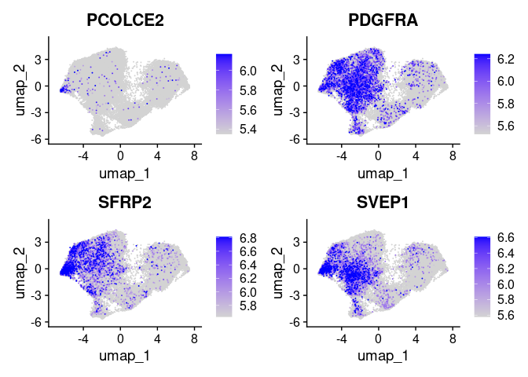<!-- -->

``` r
FeaturePlot(ipf3.fib.xen, features=c('WNT2','MEDAG','PIM1','RARRES1'),
            min.cutoff='q25', max.cutoff='q90', order=T)
```

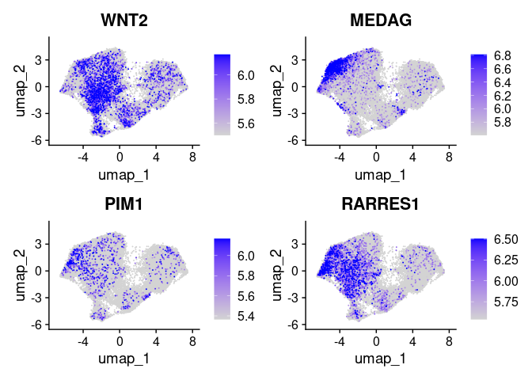<!-- -->

``` r
FeaturePlot(ipf3.fib.xen, features=c('THBS2'),
            min.cutoff='q25', max.cutoff='q90', order=T)
```

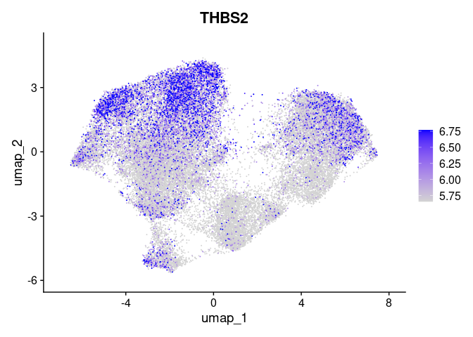<!-- -->

``` r
p <- DotPlot(ipf3.fib.xen, features=unique(c('EPCAM','ITGB6',
                                      'COL1A1','CTHRC1','POSTN','COL8A1','SCN7A','INMT','RGS5','MYH11','CNN1','SFRP2',
                                      'PLA2G2A','MFAP5','PI16','LGR5','WNT5A','CCNA1','CCNB2','CDK1','CENPF',
                                      'KIT','MKI67','PCNA','TOP2A','LTBP2','COL5A2','COL8A1','DPP6',
                                      'APOD','MFAP5','FBN1','FGFR4','PCOLCE2','PDGFRA','SFRP2','SVEP1',
                                      'WNT2','MEDAG','PIM1','RARRES1','THBS2'))
)
p + coord_flip() + scale_x_discrete(limits = rev)
```

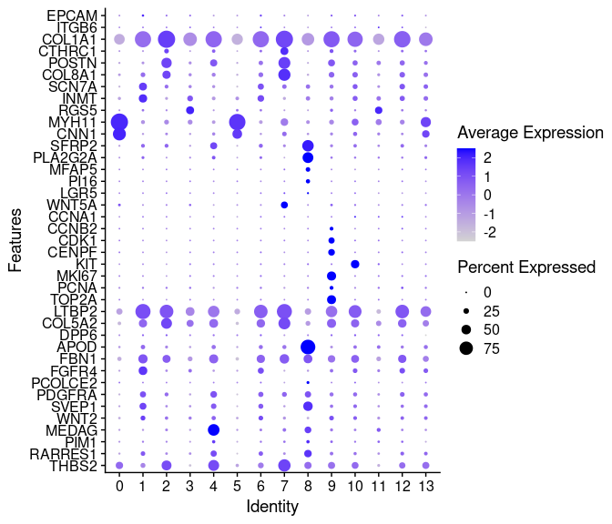<!-- -->

Rename clusters with descriptive phrases based on these markers.
``` r
ipf3.fib.xen <- RenameIdents(object = ipf3.fib.xen,
                             `0` = "SmoothMuscle",
                             `1` = "AlveolarFib",
                             `2` = "FibroticFib_CTHRC1low",
                             `3` = "Pericyte",
                             `4` = "LipoFib",
                             `5` = "SmoothMuscle",
                             `6` = "AlveolarFib",
                             `7` = "FibroticFib_CTHRC1high",
                             `9` = "ProliferatingFib",
                             `8` = "AdventitialFib",
                             `10` = "AlveolarFib",
                             `11` = "Pericyte",
                             `12` = "AlveolarFib",
                             `13` = "AlveolarFib"
                             )
ipf3.fib.xen$named_clusters <- Idents(ipf3.fib.xen)
DimPlot(ipf3.fib.xen, label=T)
```

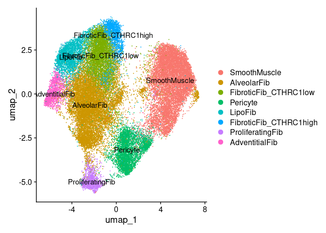<!-- -->

## Marker learning

On the theory that there might be hidden markers of utility in the
Xenium probeset that we could co-opt for next cycle.

``` r
fib.markers <- FindAllMarkers(ipf3.fib.xen, only.pos=T)
```


``` r
fib.markers %>% group_by(cluster) %>% slice_head(n=10) %>% ungroup() -> top10
```


``` r
DoHeatmap(ipf3.fib.xen, features = top10$gene) + NoLegend()
```

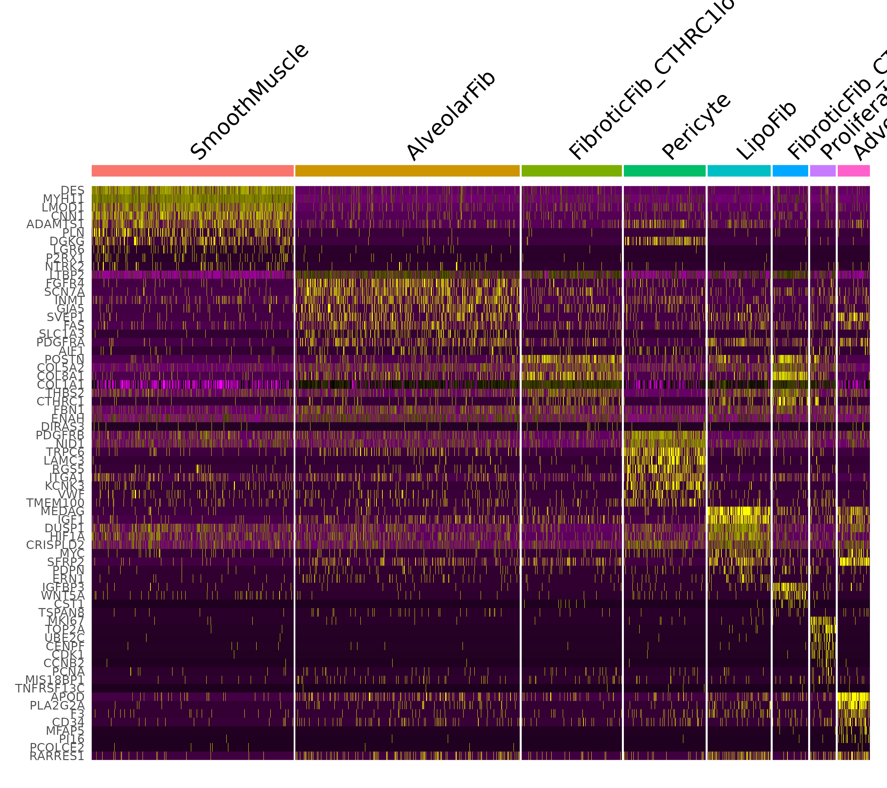<!-- -->

## Generate assignments file for Xenium Explorer

For version 1.2.0, the instructons say:

“Visualize custom cells groups in Xenium Explorer by importing a CSV
file specifying cell ids and corresponding group names. Build a CSV file
containing each cell id in the first column and the group the cell
should be assigned to in the second column. A cell may only be assigned
to one group. Not all cells in the dataset need to be included. Ensure the 
columns have headers named “cell_id” and “group”.”

This is basically the named_clusters list with a header and saved as a
CSV.

``` r
scratch <- tibble(cell_id = names(ipf3.fib.xen$named_clusters),
                      group = ipf3.fib.xen$named_clusters)
write.csv(scratch, 'Seurat_fib_named_clusters.csv')
```
