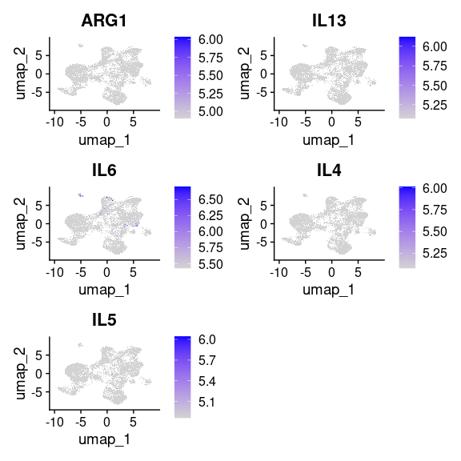

ARG1 macrophages on 0020227 for Mallar
================

- [Environment](#environment)
  - [Read in Xenium](#read-in-xenium)
- [General processing on 0020227](#general-processing-on-0020227)
  - [Filter](#filter)
  - [Standard Processing](#standard-processing)
  - [Modified Clustering](#modified-clustering)

# Environment

``` r
library(Seurat)
```

    ## Loading required package: SeuratObject

    ## Loading required package: sp

    ## 'SeuratObject' was built under R 4.3.0 but the current version is
    ## 4.3.2; it is recomended that you reinstall 'SeuratObject' as the ABI
    ## for R may have changed

    ## 
    ## Attaching package: 'SeuratObject'

    ## The following object is masked from 'package:base':
    ## 
    ##     intersect

``` r
library(tidyverse)
```

    ## ── Attaching core tidyverse packages ──────────────────────── tidyverse 2.0.0 ──
    ## ✔ dplyr     1.1.4     ✔ readr     2.1.5
    ## ✔ forcats   1.0.0     ✔ stringr   1.5.1
    ## ✔ ggplot2   3.4.4     ✔ tibble    3.2.1
    ## ✔ lubridate 1.9.3     ✔ tidyr     1.3.1
    ## ✔ purrr     1.0.2

    ## ── Conflicts ────────────────────────────────────────── tidyverse_conflicts() ──
    ## ✖ dplyr::filter() masks stats::filter()
    ## ✖ dplyr::lag()    masks stats::lag()
    ## ℹ Use the conflicted package (<http://conflicted.r-lib.org/>) to force all conflicts to become errors

## Read in Xenium

``` r
ipf3.xen <- LoadXenium('output-XETG00143__0020227__Region_1__20231214__022306/')
```

    ## 10X data contains more than one type and is being returned as a list containing matrices of each type.

    ## Warning: Feature names cannot have underscores ('_'), replacing with dashes
    ## ('-')

    ## Warning: Feature names cannot have underscores ('_'), replacing with dashes
    ## ('-')

    ## Warning: Feature names cannot have underscores ('_'), replacing with dashes
    ## ('-')

    ## Warning: Feature names cannot have underscores ('_'), replacing with dashes
    ## ('-')

    ## Warning: Feature names cannot have underscores ('_'), replacing with dashes
    ## ('-')

    ## Warning: Feature names cannot have underscores ('_'), replacing with dashes
    ## ('-')

# General processing on 0020227

## Filter

On the theory that if there was only few features, but they had counts,
it is probably still interpretable.

``` r
ipf3.filtered.xen <- subset(ipf3.xen, subset=nCount_Xenium>20 & nFeature_Xenium>4)
```

    ## Warning: Not validating FOV objects

    ## Warning: Not validating Centroids objects
    ## Not validating Centroids objects

    ## Warning: Not validating FOV objects

    ## Warning: Not validating Centroids objects

    ## Warning: Not validating FOV objects
    ## Not validating FOV objects
    ## Not validating FOV objects

    ## Warning: Not validating Seurat objects

``` r
print('original dataset:')
```

    ## [1] "original dataset:"

``` r
print(ncol(ipf3.xen))
```

    ## [1] 580730

``` r
print('filtered dataset:')
```

    ## [1] "filtered dataset:"

``` r
print(ncol(ipf3.filtered.xen))
```

    ## [1] 158303

``` r
# cleanup cleanup
rm(ipf3.xen)
gc()
```

    ##            used  (Mb) gc trigger   (Mb)  max used   (Mb)
    ## Ncells 11714517 625.7   81312316 4342.6 101640395 5428.2
    ## Vcells 60940284 465.0  274270929 2092.6 356943528 2723.3

## Standard Processing

``` r
DefaultAssay(ipf3.filtered.xen) <- 'Xenium'
ipf3.filtered.xen <- NormalizeData(ipf3.filtered.xen, verbose=F)
ipf3.filtered.xen <- FindVariableFeatures(ipf3.filtered.xen, verbose=F) # defaults to finding 2000, which would be all of them, but downstream expects this.
ipf3.filtered.xen <- ScaleData(ipf3.filtered.xen, verbose=F)
ipf3.filtered.xen <- RunPCA(ipf3.filtered.xen, npcs = 30, features = rownames(ipf3.filtered.xen), verbose=F)
ipf3.filtered.xen <- RunUMAP(ipf3.filtered.xen, dims = 1:30, verbose=F)
```

    ## Warning: The default method for RunUMAP has changed from calling Python UMAP via reticulate to the R-native UWOT using the cosine metric
    ## To use Python UMAP via reticulate, set umap.method to 'umap-learn' and metric to 'correlation'
    ## This message will be shown once per session

## Modified Clustering

Modification to reduce cluster number. i think the sparsity of data
means that pruned edges leads to more communities. Major change is the
prune.SNN parameter.

``` r
ipf3.filtered.xen <- FindNeighbors(ipf3.filtered.xen, reduction='pca', dims=1:30, prune.SNN=0) 
```

    ## Computing nearest neighbor graph

    ## Computing SNN

``` r
ipf3.filtered.xen <- FindClusters(ipf3.filtered.xen, resolution = 0.6)
```

    ## Modularity Optimizer version 1.3.0 by Ludo Waltman and Nees Jan van Eck
    ## 
    ## Number of nodes: 158303
    ## Number of edges: 34314140
    ## 
    ## Running Louvain algorithm...
    ## Maximum modularity in 10 random starts: 0.8555
    ## Number of communities: 16
    ## Elapsed time: 347 seconds

``` r
DimPlot(ipf3.filtered.xen)
```

    ## Rasterizing points since number of points exceeds 100,000.
    ## To disable this behavior set `raster=FALSE`

<!-- -->
\# ARG1 for Mallar

``` r
FeaturePlot(ipf3.filtered.xen, features=c('ARG1','IL13','IL6','IL4','IL5'),
            min.cutoff='q25', max.cutoff='q90', order=T)
```

    ## Rasterizing points since number of points exceeds 100,000.
    ## To disable this behavior set `raster=FALSE`
    ## Rasterizing points since number of points exceeds 100,000.
    ## To disable this behavior set `raster=FALSE`
    ## Rasterizing points since number of points exceeds 100,000.
    ## To disable this behavior set `raster=FALSE`
    ## Rasterizing points since number of points exceeds 100,000.
    ## To disable this behavior set `raster=FALSE`
    ## Rasterizing points since number of points exceeds 100,000.
    ## To disable this behavior set `raster=FALSE`

<!-- -->

``` r
DotPlot(ipf3.filtered.xen, features=c('ARG1','IL4','IL5','IL13','IL6'))
```

<!-- -->

``` r
ImageFeaturePlot(ipf3.filtered.xen, features=c('ARG1'),
            min.cutoff='q25', max.cutoff='q60', cols=c('white','red'))
```

<!-- -->

``` r
ImageFeaturePlot(ipf3.filtered.xen, features=c('IL4'),
            min.cutoff='q25', max.cutoff='q60', cols=c('white','red'))
```

<!-- -->

``` r
ImageFeaturePlot(ipf3.filtered.xen, features=c('IL5'),
            min.cutoff='q25', max.cutoff='q60', cols=c('white','red'))
```

<!-- -->

``` r
ImageFeaturePlot(ipf3.filtered.xen, features=c('IL13'),
            min.cutoff='q25', max.cutoff='q60', cols=c('white','red'))
```

<!-- -->

``` r
ImageFeaturePlot(ipf3.filtered.xen, features=c('IL6'),
            min.cutoff='q25', max.cutoff='q60', cols=c('white','red'))
```

<!-- -->
